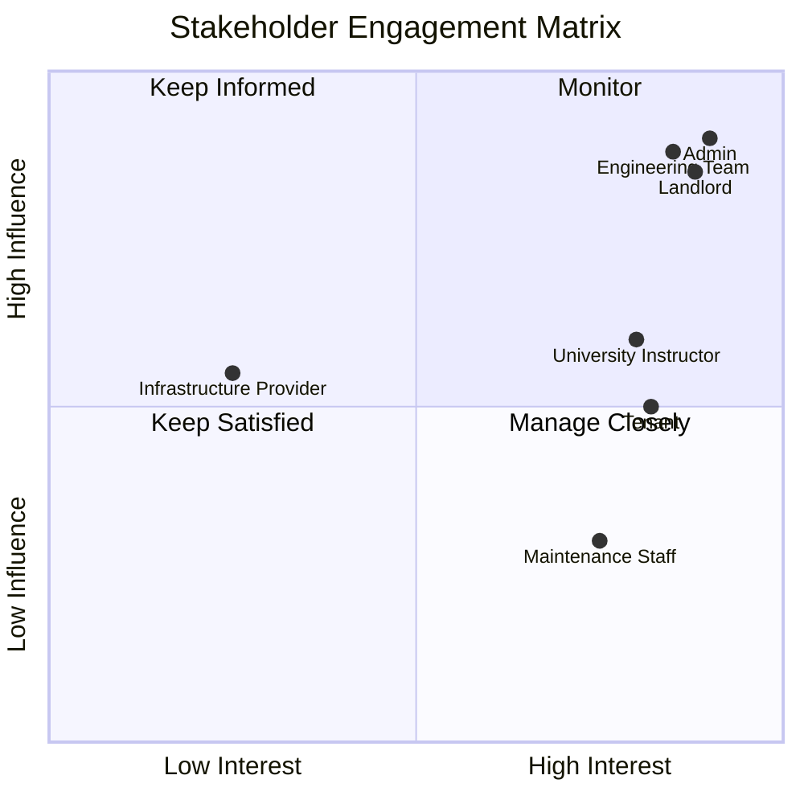

# Smart Tenant-Landlord Management Platform - Stakeholder Analysis

## Stakeholder Categories

### Primary Stakeholders
| Stakeholder | Role | Key Expectation |
|---|---|---|
| Tenants | Daily platform users — view agreements, pay rent, raise issues | Transparent workflows, easy access to rental history and request status |
| Landlords | Property owners — manage units, tenants, and agreements | Efficient rent collection, maintenance oversight, complaint resolution |
| Maintenance Staff | Assigned staff — resolve maintenance requests | Clear task assignments, status update capability, resolution tracking |
| Admin | Platform superuser — oversee all users and activity | Full visibility, user management, escalation handling |

### Secondary Stakeholders
| Stakeholder | Role | Key Expectation |
|---|---|---|
| University Instructor | Evaluator and reviewer | End-to-end traceable SDLC documentation, clean code, working demo |
| Engineering Team (M1, M2) | Builders and owners | Modular architecture, clean API contracts, on-time delivery |

### Internal Stakeholders
Engineering Team (M1 — Sadman, M2 — Zainab), QA testers, Database designer, UI/UX designer.

### External Stakeholders
University faculty reviewer, PostgreSQL/cloud infrastructure provider, JWT library maintainers, React and Django open-source communities.

## Stakeholder Influence-Interest Matrix
| Stakeholder | Influence | Interest |
|---|---|---|
| Admin | High | High |
| Landlord | High | High |
| Engineering Team | High | High |
| University Instructor | Medium | High |
| Tenant | Medium | High |
| Maintenance Staff | Low | High |
| Infrastructure Provider | Medium | Low |

## Engagement Strategy

## RACI Matrix
| Deliverable | Landlord | Tenant | Maint. Staff | Admin | M1 (Sadman) | M2 (Zainab) | Instructor |
|---|---|---|---|---|---|---|---|
| Project Overview & Problem Statement | I | I | I | I | A/R | R | C |
| Stakeholder Analysis & Feasibility | C | C | I | C | A/R | R | C |
| PRD & User Stories | C | C | I | C | A/R | R | C |
| SRS & Use Cases | I | I | I | I | A/R | R | C |
| ERD & Database Design | I | I | I | I | A/R | R | I |
| API Design | I | I | I | I | A/R | R | I |
| Landlord & Admin Modules | A | I | I | A | R | C | I |
| Tenant & Maintenance Modules | I | A | A | I | C | R | I |
| Integration Testing | C | C | C | C | A/R | R | I |
| Final Signoff | C | C | C | C | R | R | A |

**Legend:** R = Responsible, A = Accountable, C = Consulted, I = Informed.

## Stakeholder Needs Summary
| Stakeholder | Primary Need | Pain Without Platform |
|---|---|---|
| Tenant | Agreement access, rent history, maintenance tracking | Relies on landlord goodwill, no documentation |
| Landlord | Rent collection tracking, unit and tenant overview | Manual follow-ups, no consolidated view |
| Maintenance Staff | Clear task assignment and resolution workflow | Verbal requests, no accountability chain |
| Admin | User oversight, escalation tools, platform-wide analytics | No visibility, reactive issue handling |
| Instructor | Clean documentation, traceability, working demo | Inability to evaluate SDLC compliance |