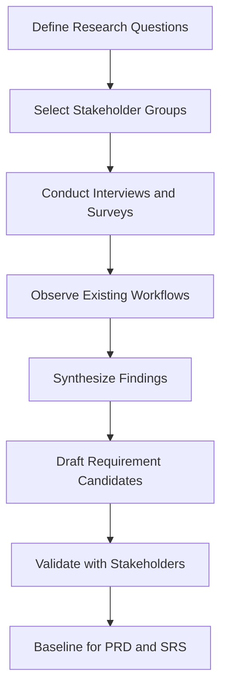

04-information-gathering.md
# Smart Tenant-Landlord Management Platform - Information Gathering Report

## Why Information Gathering Is Necessary
Requirement quality determines delivery quality. Without disciplined elicitation, development teams build features that are technically functional but operationally misaligned with what landlords, tenants, and staff actually need. This phase reduced ambiguity, surfaced hidden workflows, and established a shared, testable scope before any code was written.

## Requirement Elicitation Goals
| Goal ID | Goal |
|---|---|
| EG-01 | Identify root coordination failures in landlord-tenant workflows |
| EG-02 | Convert stakeholder pain points into measurable functional and non-functional requirements |
| EG-03 | Validate technical and operational feasibility early |
| EG-04 | Build traceable artifacts to support PRD, SRS, and academic review |

## Methodology Used
| Method | Target Group | Purpose | Output |
|---|---|---|---|
| Interviews | Landlords, tenants, maintenance staff | Deep qualitative insight into workflow pain and unmet needs | Persona pain maps, candidate user stories |
| Surveys | 80+ participants across tenant and landlord profiles | Quantitative prioritization of features and severity | Feature demand ranking, pain frequency scores |
| Observation | Informal rent payment and maintenance coordination sessions | Validate real-world workflow behavior | Process bottlenecks, informal channel mapping |
| Document Analysis | Existing rental agreements, payment receipts, complaint records | Gap and baseline capability comparison | Baseline capability matrix, digitization opportunities |

## Elicitation Process

## Key Findings
| Finding ID | Finding | Requirement Implication |
|---|---|---|
| IF-01 | Tenants have no digital copy of their rental agreement and rely on landlord goodwill for terms | FR — Rental Agreement creation, viewing, and storage |
| IF-02 | Rent reminders sent via phone are inconsistent and unlogged, causing payment disputes | FR — Rent tracking, payment history, automated reminders |
| IF-03 | Maintenance requests communicated verbally are frequently lost or deprioritized | FR — Maintenance request submission, assignment, and status tracking |
| IF-04 | Complaints have no escalation path, leading to unresolved disputes | FR — Complaint filing, landlord response, admin escalation |
| IF-05 | Landlords managing multiple properties have no consolidated view of units and tenants | FR — Landlord dashboard, property and unit management |
| IF-06 | Maintenance staff receive no formal assignment and have no way to update resolution status | FR — Maintenance staff workflow, status update, resolution notes |
| IF-07 | Admins have no platform-wide visibility over users, activity, or escalated issues | FR — Admin panel, user management, analytics dashboard |
| IF-08 | Session security and role-based access are expected by all user types | NFR — JWT authentication, role-based access control |

## Requirement Themes
1. **Agreement transparency:** tenants and landlords need equal, permanent access to signed agreements.
2. **Payment accountability:** automated tracking and reminders replace informal follow-ups.
3. **Maintenance lifecycle:** structured request flow from submission to verified resolution.
4. **Complaint escalation:** formal path from tenant complaint through landlord to admin.
5. **Role-based visibility:** each user sees exactly what their role requires — no more, no less.
6. **Security baseline:** JWT sessions, role enforcement, and audit trail across all modules.

## Outcome
The elicitation output became the direct baseline for the PRD, user personas, user stories, functional and non-functional requirements, use cases, SRS, technical design, and QA traceability matrix. Every major feature in the platform can be traced back to a finding in this report.