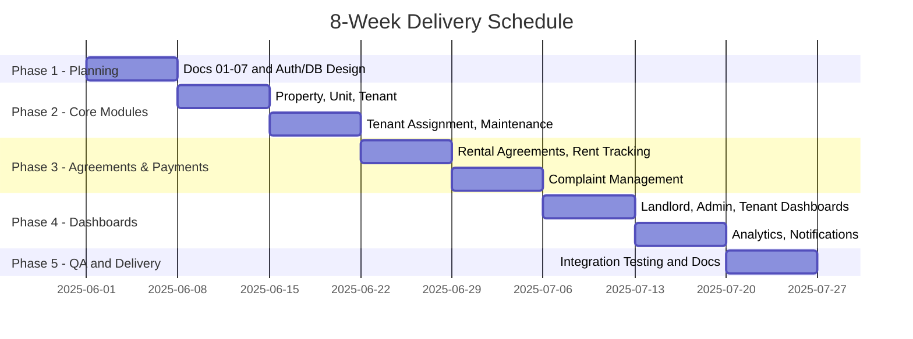

# Smart Tenant-Landlord Management Platform - Feasibility Analysis

## Feasibility Summary
| Dimension | Status | Conclusion |
|---|---|---|
| Technical | Feasible | Chosen stack fully supports all required modules and role-based access |
| Economic | Feasible | Academic project with zero operational cost; future commercial deployment is viable |
| Operational | Feasible | Two-person team with clean module ownership and GitHub-based workflow |
| Legal | Feasible with controls | User data handling requires basic privacy and access controls |
| Schedule | Feasible | Full delivery in 8 weeks with phased milestone structure |
| Risk | Manageable | Primary risks are scope creep and integration delays — both mitigated by issue tracking |

## Technical Feasibility
- **Frontend:** React.js supports modular, component-based UI with role-aware routing and responsive design.
- **Backend:** Django REST Framework provides rapid API development, built-in ORM, serializers, and permission classes ideal for role-based access control.
- **Database:** PostgreSQL offers relational integrity for agreements, rent records, and maintenance assignments — all of which require structured, auditable data.
- **Auth:** JWT provides stateless, scalable authentication suitable for four distinct user roles without server-side session storage.
- **Version Control & PM:** GitHub Issues + GitHub Projects Kanban board provides full traceability from task to commit.

## Economic Feasibility
### Cost Estimate (Academic Delivery)
| Cost Component | Estimated Cost |
|---|---|
| Engineering effort (M1 + M2, 8 weeks) | Academic — no monetary cost |
| Hosting (local development + GitHub) | Free tier |
| Tooling (VS Code, Postman, GitHub) | Free |
| PostgreSQL (local instance) | Free |
| **Total** | **BDT 0 (Academic Project)** |

### Benefit Estimate (Commercial Deployment Projection)
| Benefit Component | Estimated Value |
|---|---|
| Reduced landlord admin overhead | High — eliminates manual rent tracking |
| Faster maintenance resolution | Medium — structured workflow cuts resolution time |
| Tenant retention improvement | Medium — transparency increases satisfaction |
| Dispute reduction (documented agreements) | High — audit trail prevents verbal disputes |
| **Overall ROI (Commercial)** | **Positive with modest SaaS pricing model** |

## Operational Feasibility
| Area | Readiness | Notes |
|---|---|---|
| Team structure | High | Clean M1/M2 split with no overlap in primary ownership |
| Development workflow | High | GitHub Issues, Kanban board, milestone-based delivery |
| Documentation | High | 28 documents planned across all SDLC phases |
| Testing | Medium | Integration testing in Week 8; unit tests alongside development |
| Deployment | Medium | Local deployment for academic submission; cloud-ready architecture |

## Legal Feasibility
1. User passwords must be hashed — no plaintext storage at any layer.
2. JWT tokens must be short-lived with secure refresh handling.
3. Role-based access must enforce data isolation — tenants cannot access other tenants' data.
4. Rental agreement records must be immutable once signed.
5. No real payment data is handled in this release — eliminates PCI compliance scope.

## Schedule Feasibility

## Risk Feasibility
| Risk Category | Feasibility Concern | Mitigation |
|---|---|---|
| Schedule | 8 weeks is tight for 10 modules across 2 developers | Clean M1/M2 module split, weekly milestones, no scope creep |
| Technical | Django + React integration friction at API boundary | Shared API contract defined in Week 1 before development |
| Data integrity | Relational consistency across agreements, rent, and units | PostgreSQL foreign key constraints and DRF serializer validation |
| Security | JWT token exposure or role bypass | Short-lived tokens, DRF permission classes on every endpoint |
| Integration | M1 and M2 modules failing to work together in Week 8 | Shared DB schema agreed in Week 1, integration testing reserved in Week 8 |

## Conclusion
The Smart Tenant-Landlord Management Platform is feasible across all six dimensions. The technology stack is well-matched to the problem, the team structure is clean, the 8-week schedule is achievable with disciplined scope control, and risks are manageable with the mitigations defined above. The project is cleared to proceed to the PRD phase.