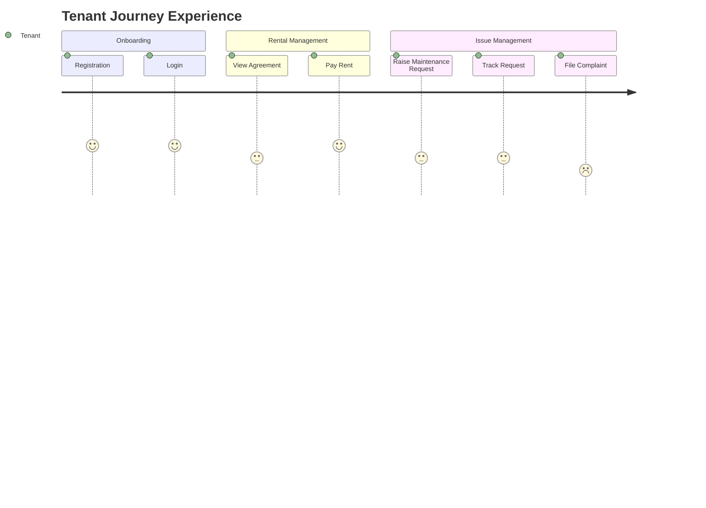
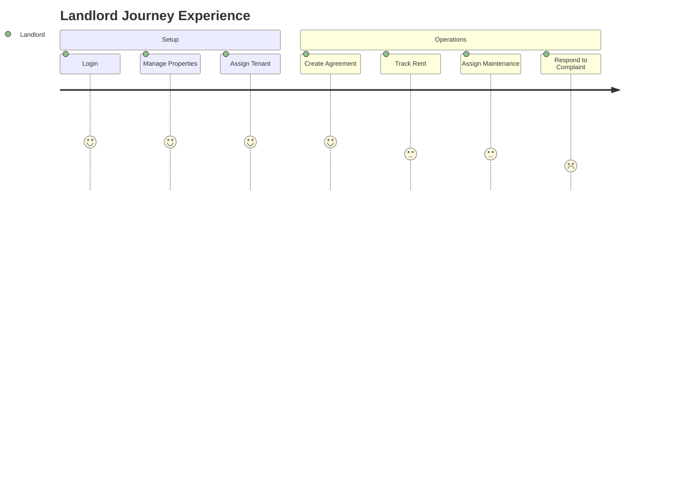
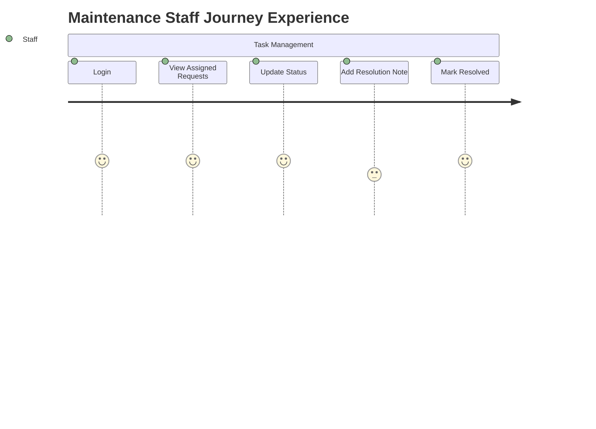
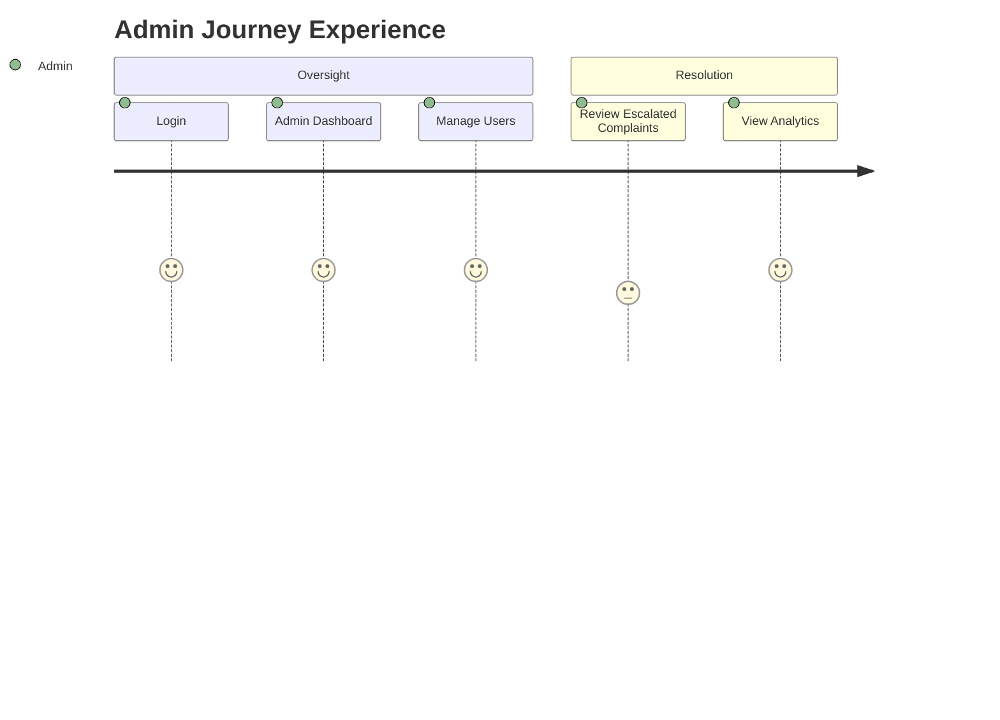

10-user-journey.md
# Smart Tenant-Landlord Management Platform - User Journey Map

## Journey 1 - Tenant (Rafiq)
### Journey Stages
Registration → Login → View Agreement → Pay Rent → Raise Maintenance Request → Track Request → File Complaint

### End-to-End Journey Table
| Stage | User Goal | User Actions | System Response | Pain Risk | Improvement Opportunities | Linked IDs |
|---|---|---|---|---|---|---|
| Registration | Create tenant account | Submit name, email, password, role selection | Validate input, create user, issue JWT | Confusion over role selection | Clear role picker with short description | UC-01, FR-001..FR-003 |
| Login | Access tenant dashboard | Enter credentials | Authenticate, issue JWT, redirect to tenant dashboard | Failed auth loops | Clear error feedback, password recovery link | UC-02, FR-004..FR-007 |
| View Agreement | Access rental terms anytime | Navigate to Agreements tab | Display signed agreement with unit and landlord details | Agreement not yet created by landlord | Show pending state with helpful message | UC-10, FR-021..FR-023 |
| Pay Rent | Log monthly payment | Submit payment amount and date | Record payment, update payment history, notify landlord | Accidental duplicate entry | Confirmation step before submission | UC-11, FR-024..FR-026 |
| Raise Maintenance Request | Report an issue | Describe issue, select unit, submit request | Create request, notify landlord/staff, show status as Open | Vague descriptions cause slow resolution | Structured issue type selector | UC-12, FR-027..FR-029 |
| Track Request | Know if issue is being handled | View request status page | Show current status, assigned staff, timestamps | No updates after submission | Push notification on status change | UC-13, FR-030..FR-031 |
| File Complaint | Escalate unresolved issue | Submit complaint with description | Log complaint, notify landlord, escalate path to admin | No confirmation of receipt | Immediate acknowledgment notification | UC-14, FR-032..FR-034 |

### Experience Heatmap

---

## Journey 2 - Landlord (Karim)
### Journey Stages
Login → Manage Properties → Assign Tenant → Create Agreement → Track Rent → Assign Maintenance → Respond to Complaint

### End-to-End Journey Table
| Stage | User Goal | User Actions | System Response | Pain Risk | Improvement Opportunities | Linked IDs |
|---|---|---|---|---|---|---|
| Login | Access landlord dashboard | Enter credentials | Authenticate, redirect to landlord dashboard with overview | Stale dashboard data | Real-time KPI refresh on login | UC-02, FR-004..FR-007 |
| Manage Properties | Add and configure properties | Create property, add units, set occupancy status | Persist property and unit records | Incorrect unit count | Inline unit count validator | UC-03, FR-008..FR-012 |
| Assign Tenant | Link tenant to unit | Search tenant, select unit, confirm assignment | Update unit occupancy, notify tenant | Assigning already-occupied unit | Occupancy check before assignment | UC-05, FR-015..FR-017 |
| Create Agreement | Formalize rental terms | Fill agreement form, set terms, submit | Create agreement, link to tenant and unit, notify tenant | Incomplete agreement fields | Required field validation, preview before save | UC-09, FR-021..FR-023 |
| Track Rent | Monitor payment status | View rent dashboard, check overdue list | Show payment history per tenant, flag overdue | Missed overdue tenants | Overdue banner on dashboard, reminder trigger | UC-11, FR-024..FR-026 |
| Assign Maintenance | Delegate repair task | View open requests, assign to staff | Notify assigned staff, update request status | Wrong staff assigned | Staff skill/availability filter | UC-13, FR-028..FR-031 |
| Respond to Complaint | Address tenant complaint | Open complaint, write response, mark resolved | Update complaint status, notify tenant | Complaint escalated before response | Response deadline indicator | UC-14, FR-032..FR-034 |

### Experience Heatmap

---

## Journey 3 - Maintenance Staff (Sadia)
### Journey Stages
Login → View Assigned Requests → Update Status → Add Resolution Note → Mark Resolved

### End-to-End Journey Table
| Stage | User Goal | User Actions | System Response | Pain Risk | Improvement Opportunities | Linked IDs |
|---|---|---|---|---|---|---|
| Login | Access staff task view | Enter credentials | Authenticate, redirect to staff dashboard | Generic dashboard with irrelevant content | Staff-specific view showing only assigned requests | UC-02, FR-004..FR-007 |
| View Assigned Requests | See what needs to be done | Open maintenance queue | Show request list with unit, issue type, and timestamp | Unclear priority order | Sort by submission date, urgency flag | UC-13, FR-027..FR-029 |
| Update Status | Signal progress to landlord/tenant | Change status to In Progress | Update request record, notify landlord | Forgetting to update until resolution | One-tap status update from request card | UC-13, FR-030 |
| Add Resolution Note | Document what was done | Enter resolution description | Persist note against request | Vague notes causing follow-up questions | Structured resolution template | UC-13, FR-031 |
| Mark Resolved | Close out completed work | Set status to Resolved | Update record, notify tenant and landlord, timestamp resolution | Marking resolved before tenant confirms | Optional tenant acknowledgment flag | UC-13, FR-031 |

### Experience Heatmap

---

## Journey 4 - Admin (Nadia)
### Journey Stages
Login → Admin Dashboard → Manage Users → Review Escalated Complaints → View Analytics

### End-to-End Journey Table
| Stage | User Goal | User Actions | System Response | Pain Risk | Improvement Opportunities | Linked IDs |
|---|---|---|---|---|---|---|
| Login | Access admin control panel | Enter credentials | Authenticate, redirect to admin dashboard | Overwhelming data on first load | Prioritized alert panel at top of dashboard | UC-02, FR-004..FR-007 |
| Admin Dashboard | Get platform-wide overview | View user counts, active properties, open complaints | Display real-time metrics across all entities | Metrics lag or stale data | Auto-refresh with last-updated timestamp | UC-15, FR-035..FR-038 |
| Manage Users | Add, deactivate, or change user roles | Search user, edit role or status, save | Update user record, reflect across all sessions | Accidental deactivation of active tenant | Confirmation modal with impact warning | UC-16, FR-039..FR-041 |
| Review Escalated Complaints | Resolve disputes landlord could not handle | Open escalated complaint, review history, post resolution | Mark complaint resolved, notify all parties | Insufficient complaint history visible | Full thread view with all prior responses | UC-17, FR-032..FR-034 |
| View Analytics | Understand platform health | Navigate to analytics page, apply filters | Render charts for occupancy, rent, maintenance trends | Charts too generic to be actionable | Drill-down by property and date range | UC-18, FR-042..FR-045 |

### Experience Heatmap

---

## Key Journey Improvements Across All Roles
1. Every role benefits from real-time status updates — notifications are a cross-cutting requirement.
2. Complaint resolution has the lowest satisfaction score across both Tenant and Landlord journeys — structured escalation is critical.
3. Maintenance tracking is the most traversed journey segment — it must be the most polished workflow.
4. Role-based dashboard redirection on login eliminates navigation confusion for all personas.