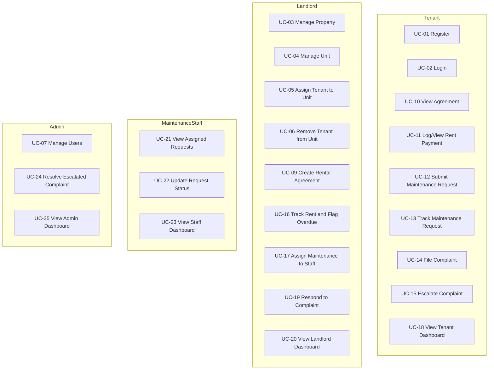

# Smart Tenant-Landlord Management Platform - Use Cases

## Use Case Diagram

---

## UC-01 Register
| Field | Details |
|---|---|
| Actor | Guest User (any role) |
| Preconditions | User is not authenticated; email not yet registered |
| Primary Flow | 1) User opens registration page 2) Enters name, email, password, and selects role 3) Submits form 4) System validates input and enforces unique email 5) Account created and success response returned |
| Alternative Flow | A1: Email already exists → return `409 CONFLICT` with error message. A2: Password fails policy → return inline validation error. A3: Role not selected → return field required error. |
| Post Conditions | Account persisted in database; user can log in |
| Related FR | FR-001, FR-002, FR-003 |

---

## UC-02 Login
| Field | Details |
|---|---|
| Actor | Registered User (any role) |
| Preconditions | Account exists and is active |
| Primary Flow | 1) User enters email and password 2) System validates credentials 3) JWT access and refresh tokens issued 4) User redirected to role-specific dashboard |
| Alternative Flow | A1: Invalid credentials → return `401 UNAUTHORIZED`. A2: Deactivated account → return `403 FORBIDDEN` with account suspended message. |
| Post Conditions | Authenticated session established; role-specific dashboard visible |
| Related FR | FR-004, FR-005, FR-006, FR-007, FR-008 |

---

## UC-03 Manage Property
| Field | Details |
|---|---|
| Actor | Landlord |
| Preconditions | Landlord is authenticated |
| Primary Flow | 1) Landlord navigates to Properties 2) Creates property with name, address, and description 3) System persists and returns property in list 4) Landlord can edit or delete existing properties |
| Alternative Flow | A1: Missing required fields → return validation error. A2: Delete attempted on property with active tenants → return conflict error. |
| Post Conditions | Property record created, updated, or deleted; reflects in landlord dashboard |
| Related FR | FR-012, FR-013, FR-014, FR-015 |

---

## UC-04 Manage Unit
| Field | Details |
|---|---|
| Actor | Landlord |
| Preconditions | Landlord is authenticated; at least one property exists |
| Primary Flow | 1) Landlord opens a property 2) Adds unit with floor, size, and monthly rent 3) System persists unit with status Vacant 4) Landlord can edit or delete units |
| Alternative Flow | A1: Delete attempted on occupied unit → return conflict error. A2: Missing rent amount → return validation error. |
| Post Conditions | Unit record persisted under property; occupancy status set to Vacant |
| Related FR | FR-016, FR-017, FR-018, FR-019 |

---

## UC-05 Assign Tenant to Unit
| Field | Details |
|---|---|
| Actor | Landlord |
| Preconditions | Landlord is authenticated; target unit is Vacant; tenant account exists |
| Primary Flow | 1) Landlord opens unit 2) Selects a tenant from the registered tenant list 3) Confirms assignment 4) Unit status updated to Occupied 5) Tenant receives assignment notification |
| Alternative Flow | A1: Unit already Occupied → return conflict error and block assignment. |
| Post Conditions | Tenant linked to unit; unit status = Occupied; notification sent to tenant |
| Related FR | FR-020, FR-021, FR-022, FR-025 |

---

## UC-06 Remove Tenant from Unit
| Field | Details |
|---|---|
| Actor | Landlord |
| Preconditions | Landlord is authenticated; unit is Occupied |
| Primary Flow | 1) Landlord opens occupied unit 2) Selects remove tenant 3) Confirms action 4) System clears tenant assignment 5) Unit status updated to Vacant |
| Alternative Flow | A1: Active agreement exists for this tenant-unit pair → system warns landlord before proceeding. |
| Post Conditions | Tenant unlinked from unit; unit status = Vacant |
| Related FR | FR-023 |

---

## UC-07 Manage Users (Admin)
| Field | Details |
|---|---|
| Actor | Admin |
| Preconditions | Admin is authenticated |
| Primary Flow | 1) Admin navigates to user management panel 2) Searches or browses user list 3) Activates, deactivates, or changes role of a user 4) System applies change and returns updated user record |
| Alternative Flow | A1: Admin attempts to deactivate themselves → block action with error. |
| Post Conditions | User account status or role updated; if deactivated, all active tokens invalidated |
| Related FR | FR-010, FR-011 |

---

## UC-08 Update Profile
| Field | Details |
|---|---|
| Actor | Authenticated User (any role) |
| Preconditions | User is logged in |
| Primary Flow | 1) User navigates to profile settings 2) Updates name or contact details 3) Submits form 4) System persists changes and returns updated profile |
| Alternative Flow | A1: Invalid input format → return inline validation error. |
| Post Conditions | Profile record updated in database |
| Related FR | FR-009 |

---

## UC-09 Create Rental Agreement
| Field | Details |
|---|---|
| Actor | Landlord |
| Preconditions | Landlord is authenticated; tenant is assigned to the unit |
| Primary Flow | 1) Landlord navigates to Agreements 2) Selects tenant and unit 3) Enters start date, end date, and monthly rent amount 4) Submits 5) Agreement created with status Active 6) Tenant notified |
| Alternative Flow | A1: End date before start date → return validation error. A2: No tenant assigned to selected unit → block creation. |
| Post Conditions | Agreement persisted and linked to tenant and unit; tenant notified |
| Related FR | FR-026, FR-029 |

---

## UC-10 View Rental Agreement
| Field | Details |
|---|---|
| Actor | Tenant |
| Preconditions | Tenant is authenticated; active agreement exists |
| Primary Flow | 1) Tenant navigates to Agreements section 2) System returns active agreement with unit, landlord, terms, start date, and end date |
| Alternative Flow | A1: No agreement exists yet → display pending state with message. |
| Post Conditions | Tenant can read full agreement terms |
| Related FR | FR-027, FR-028, FR-029 |

---

## UC-11 Log and View Rent Payment
| Field | Details |
|---|---|
| Actor | Landlord (log), Tenant (view) |
| Preconditions | Active rental agreement exists for the tenant-unit pair |
| Primary Flow | 1) Landlord logs payment with tenant, amount, and payment date 2) System persists payment and updates rent dashboard 3) Tenant views payment history showing all logged payments |
| Alternative Flow | A1: Payment date in the future → warn landlord before saving. |
| Post Conditions | Payment record persisted; reflects in both landlord rent dashboard and tenant payment history |
| Related FR | FR-030, FR-031, FR-032 |

---

## UC-12 Submit Maintenance Request
| Field | Details |
|---|---|
| Actor | Tenant |
| Preconditions | Tenant is authenticated and assigned to a unit |
| Primary Flow | 1) Tenant navigates to Maintenance 2) Enters issue description and selects issue type 3) Submits request 4) Request created with status Open 5) Landlord notified |
| Alternative Flow | A1: Description is empty → return validation error. |
| Post Conditions | Maintenance request persisted with status Open; landlord notified |
| Related FR | FR-035, FR-036 |

---

## UC-13 Assign and Resolve Maintenance Request
| Field | Details |
|---|---|
| Actor | Landlord (assign), Maintenance Staff (update and resolve) |
| Preconditions | Open maintenance request exists; maintenance staff account exists |
| Primary Flow | 1) Landlord views open requests 2) Assigns request to a staff member 3) Staff notified 4) Staff updates status to In Progress 5) Staff adds resolution note and marks Resolved 6) Tenant and landlord notified |
| Alternative Flow | A1: No available staff → landlord can leave unassigned and return later. |
| Post Conditions | Request status = Resolved; resolution note stored; all parties notified |
| Related FR | FR-037, FR-038, FR-039, FR-040, FR-041 |

---

## UC-14 File Complaint
| Field | Details |
|---|---|
| Actor | Tenant |
| Preconditions | Tenant is authenticated and assigned to a unit |
| Primary Flow | 1) Tenant navigates to Complaints 2) Enters complaint description 3) Submits 4) Complaint created with status Open 5) Landlord notified |
| Alternative Flow | A1: Description is empty → return validation error. |
| Post Conditions | Complaint persisted with status Open; landlord notified |
| Related FR | FR-042, FR-043 |

---

## UC-15 Escalate and Resolve Complaint
| Field | Details |
|---|---|
| Actor | Landlord (respond), Tenant (escalate), Admin (resolve) |
| Preconditions | Complaint exists with status Open or Responded |
| Primary Flow | 1) Landlord responds to complaint 2) Tenant receives response notification 3) If unsatisfied, tenant escalates to admin 4) Admin reviews complaint thread 5) Admin submits resolution 6) Complaint status = Resolved; all parties notified |
| Alternative Flow | A1: Landlord does not respond → tenant can escalate after any time. |
| Post Conditions | Complaint status = Resolved; full thread preserved for audit |
| Related FR | FR-044, FR-045, FR-046 |

---

## UC-16 Track Rent and Flag Overdue
| Field | Details |
|---|---|
| Actor | Landlord |
| Preconditions | Landlord is authenticated; active agreements exist |
| Primary Flow | 1) Landlord opens rent dashboard 2) Views all tenant payment statuses 3) Overdue tenants are flagged automatically 4) Landlord can send reminder manually or relies on scheduled reminder |
| Alternative Flow | A1: No payments due yet → dashboard shows all statuses as current. |
| Post Conditions | Overdue flag reflects on dashboard; tenant rent due reminder notification sent |
| Related FR | FR-032, FR-033, FR-034 |

---

## UC-17 View and Manage Notifications
| Field | Details |
|---|---|
| Actor | Any authenticated user |
| Preconditions | User is logged in; at least one notification-triggering event has occurred |
| Primary Flow | 1) User opens notification panel 2) Unread notifications listed with type and timestamp 3) User reads notification 4) Notification marked as read and removed from unread count |
| Alternative Flow | A1: No notifications → display empty state message. |
| Post Conditions | Notification read status updated; unread count decremented |
| Related FR | FR-047, FR-048, FR-049, FR-050, FR-051 |

---

## UC-18 View Role-Specific Dashboard
| Field | Details |
|---|---|
| Actor | Any authenticated user |
| Preconditions | User is logged in; role-specific data exists |
| Primary Flow | 1) User logs in and is redirected to dashboard 2) System renders role-specific KPIs and activity summaries 3) Tenant sees agreement, payments, and requests; Landlord sees occupancy, rent, maintenance, complaints; Admin sees platform-wide metrics; Staff sees assigned request queue |
| Alternative Flow | A1: No data yet for new user → display empty state with onboarding guidance. |
| Post Conditions | Dashboard rendered with latest role-relevant data |
| Related FR | FR-052, FR-053, FR-054, FR-055, FR-056, FR-057, FR-058 |
