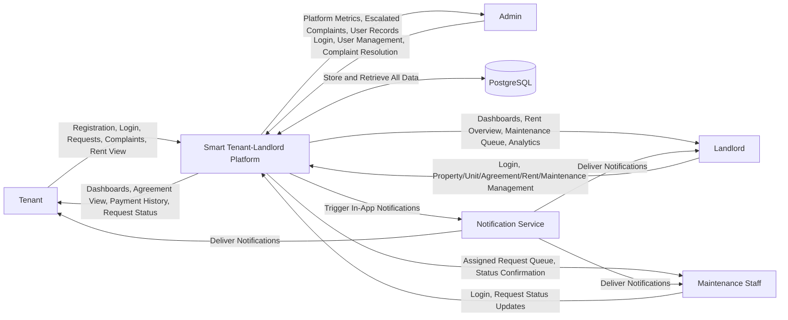
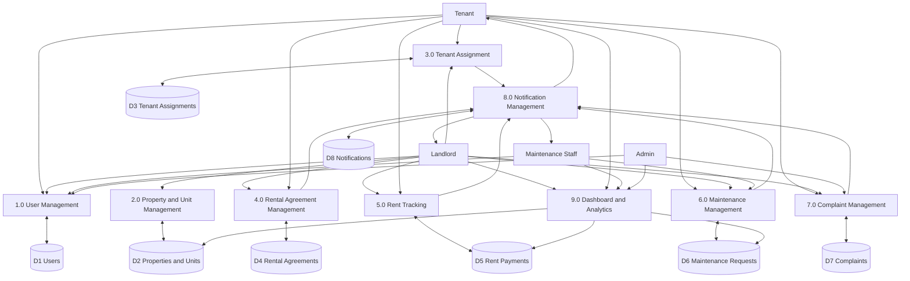
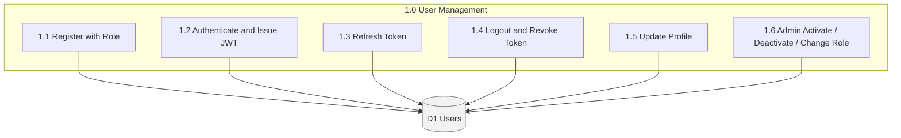
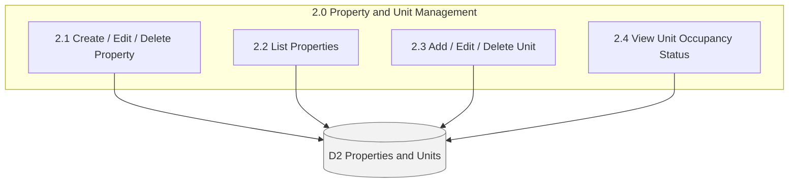
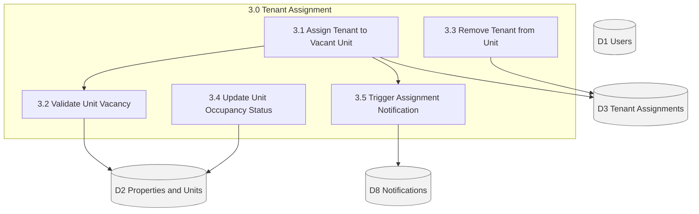
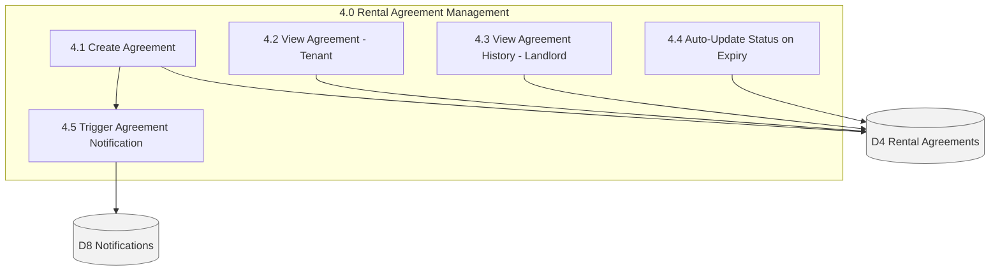
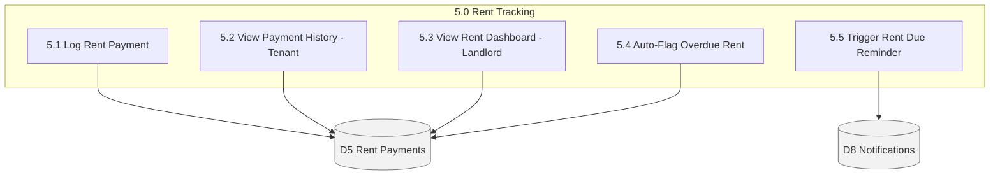
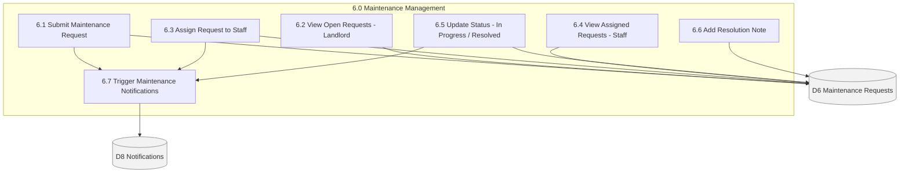
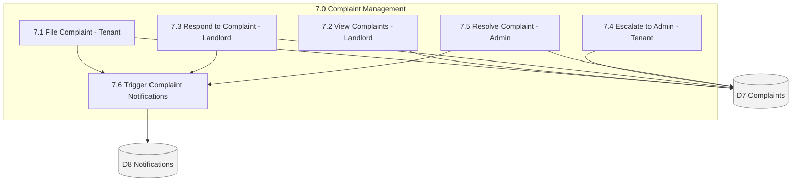
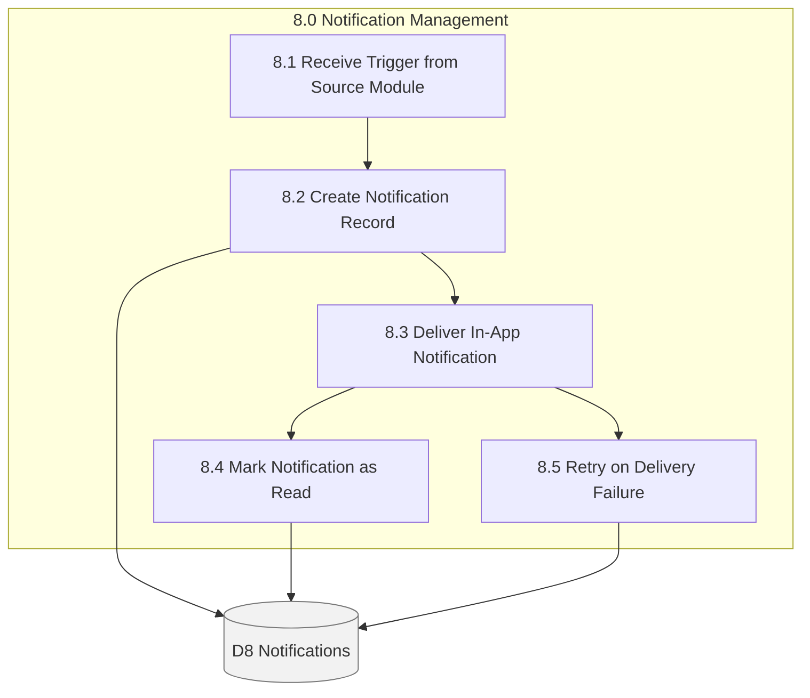

# Smart Tenant-Landlord Management Platform - Data Flow Diagrams (DFD)

## Context Diagram

## Level 0 DFD

## Level 1 DFD - Process Decomposition

### 1.0 User Management

### 2.0 Property and Unit Management

### 3.0 Tenant Assignment

### 4.0 Rental Agreement Management

### 5.0 Rent Tracking

### 6.0 Maintenance Management

### 7.0 Complaint Management

### 8.0 Notification Management

