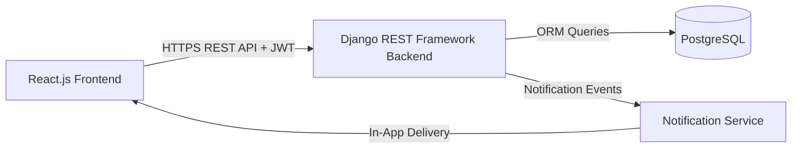

# Smart Tenant-Landlord Management Platform - Software Requirements Specification (SRS)

## 1. Introduction

### 1.1 Purpose
This SRS defines the complete functional and non-functional requirements for the Smart Tenant-Landlord Management Platform — a full-stack web application that digitalizes the rental lifecycle for tenants, landlords, maintenance staff, and administrators. It serves as the authoritative requirements baseline for all design, development, and testing decisions.

### 1.2 Scope
The platform supports role-based authentication, property and unit management, tenant assignment, rental agreement creation and viewing, rent tracking, maintenance request lifecycle, complaint escalation, in-app notifications, and role-specific dashboards and analytics. It is built on React.js (frontend), Django REST Framework (backend), PostgreSQL (database), and JWT (authentication).

### 1.3 Definitions and Acronyms
| Term | Meaning |
|---|---|
| FR | Functional Requirement |
| NFR | Non-Functional Requirement |
| JWT | JSON Web Token |
| SRS | Software Requirements Specification |
| PRD | Product Requirements Document |
| DFD | Data Flow Diagram |
| ERD | Entity Relationship Diagram |
| TDD | Technical Design Document |
| UC | Use Case |
| US | User Story |
| AC | Acceptance Criteria |
| DRF | Django REST Framework |
| RBAC | Role-Based Access Control |
| API | Application Programming Interface |
| P95 | 95th Percentile Response Time |

### 1.4 References
| Document | Location |
|---|---|
| Project Overview | [01-project-overview.md](01-project-overview.md) |
| Problem Statement | [02-problem-statement.md](02-problem-statement.md) |
| Stakeholder Analysis | [03-stakeholder-analysis.md](03-stakeholder-analysis.md) |
| PRD | [08-prd.md](08-prd.md) |
| User Personas | [09-user-personas.md](09-user-personas.md) |
| User Stories | [11-user-stories.md](11-user-stories.md) |
| Acceptance Criteria | [12-acceptance-criteria.md](12-acceptance-criteria.md) |
| Functional Requirements | [13-functional-requirements.md](13-functional-requirements.md) |
| Non-Functional Requirements | [14-non-functional-requirements.md](14-non-functional-requirements.md) |
| Use Cases | [15-use-cases.md](15-use-cases.md) |
| DFD | [16-dfd.md](16-dfd.md) |
| ERD | [18-erd.md](18-erd.md) |
| API Design | [22-api-design.md](22-api-design.md) |
| Traceability Matrix | [25-traceability-matrix.md](25-traceability-matrix.md) |

---

## 2. Overall Description

### 2.1 Product Perspective
The Smart Tenant-Landlord Management Platform is a three-tier web application:
1. **React.js frontend** — role-aware SPA with protected routes and responsive UI.
2. **Django REST Framework backend** — RESTful API layer with JWT authentication and DRF permission classes enforcing RBAC.
3. **PostgreSQL database** — relational persistence for all domain entities with referential integrity.

### 2.2 Product Functions
| Function Group | Description |
|---|---|
| Authentication & Access | Registration, login, JWT lifecycle, role-based access enforcement |
| Property & Unit Management | Landlord creates and manages properties and their individual units |
| Tenant Management | Tenant assignment to units, profile management, occupancy tracking |
| Rental Agreements | Digital agreement creation, viewing, status lifecycle |
| Rent Tracking | Payment logging, history, overdue detection, reminders |
| Maintenance Management | Request submission, assignment, status updates, resolution |
| Complaint Management | Filing, landlord response, tenant escalation, admin resolution |
| Notifications | In-app event-driven notifications across all roles |
| Dashboards & Analytics | Role-specific KPI dashboards, occupancy and rent charts |

### 2.3 User Classes
| User Class | Description | Access Level |
|---|---|---|
| Tenant | Rents a unit; manages their own agreements, payments, requests, and complaints | Restricted to own records |
| Landlord | Owns properties; manages units, tenants, agreements, rent, maintenance, and complaints | Full access to their own properties |
| Maintenance Staff | Assigned to maintenance requests; updates status and resolution | Limited to assigned requests |
| Admin | Platform superuser; manages all users, oversees platform activity, resolves escalations | Full platform access |

### 2.4 Operating Environment
- Modern web browsers (Chrome 110+, Firefox 110+, Edge 110+, Safari 16+)
- Backend: Python 3.11+, Django 4.x, Django REST Framework
- Database: PostgreSQL 15+
- Frontend: React.js 18+, Node.js 18+
- Development: Local environment with documented setup via README

### 2.5 Constraints
1. JWT-based authentication is mandatory; server-side session storage is not used.
2. The MVP scope is fixed to the 8-week academic delivery timeline.
3. Role-based access control must be enforced at the API layer — client-side role checks alone are insufficient.
4. Rental agreement records are immutable once created; only status transitions are permitted.
5. No real payment gateway integration in this release.

### 2.6 Assumptions and Dependencies
1. Each unit is occupied by at most one primary tenant at a time.
2. Users have reliable internet access and a modern browser.
3. Notifications are in-app only; email delivery is optional.
4. The shared PostgreSQL schema and JWT auth module are agreed between M1 and M2 in Week 1 before module development begins.
5. Django migration files are the sole mechanism for schema changes; no manual database alterations.

---

## 3. Functional Requirements

Complete baseline in [13-functional-requirements.md](13-functional-requirements.md).

### 3.1 Summary by Domain
| Domain | FR Range | Module Owner |
|---|---|---|
| Authentication & Account Management | FR-001..FR-011 | M1 + M2 (shared) |
| Property & Unit Management | FR-012..FR-019 | M1 |
| Tenant Assignment | FR-020..FR-025 | M1 |
| Rental Agreements | FR-026..FR-029 | M1 (create), M2 (view) |
| Rent Tracking | FR-030..FR-034 | M1 |
| Maintenance Management | FR-035..FR-041 | M2 |
| Complaint Management | FR-042..FR-046 | M2 |
| Notifications | FR-047..FR-051 | M2 |
| Dashboards & Analytics | FR-052..FR-058 | M1 (Landlord/Admin), M2 (Tenant/Staff) |

### 3.2 Must-Have FR Summary (MVP)
| Priority | Count | FR IDs |
|---|---|---|
| High (Must Have) | 46 | FR-001..FR-016, FR-019..FR-028, FR-030..FR-044, FR-047..FR-055 |
| Medium (Should Have) | 12 | FR-017..FR-018, FR-025, FR-029, FR-045, FR-046, FR-051, FR-056..FR-058 |

---

## 4. Non-Functional Requirements

Complete baseline in [14-non-functional-requirements.md](14-non-functional-requirements.md).

### 4.1 Quality Attribute Summary
| Quality Attribute | NFR IDs | Key Target |
|---|---|---|
| Performance | NFR-001..NFR-004 | P95 read <= 500 ms, notification <= 5 s |
| Availability & Reliability | NFR-005..NFR-009 | >= 99.5% uptime, acknowledged writes |
| Scalability | NFR-010..NFR-011 | Stateless JWT, 50k+ rent records |
| Security | NFR-012..NFR-018 | JWT expiry, bcrypt, TLS, tenant data isolation |
| Usability | NFR-019..NFR-021 | Onboarding <= 5 min, mobile >= 375 px |
| Maintainability | NFR-022..NFR-025 | >= 70% test coverage, env vars, separate Django apps |
| Portability | NFR-026..NFR-027 | README setup, migrations only |
| Compliance | NFR-028..NFR-029 | Token invalidation, immutable agreements |
| Observability | NFR-030 | Request/response logging on all API calls |

---

## 5. External Interface Requirements

### 5.1 User Interfaces
- Role-specific SPA with protected routes enforced by JWT role claim.
- Responsive design supporting screens >= 375 px wide.
- Inline form validation with error messages displayed within 500 ms of submission failure.
- Role-specific dashboard as default landing page after login.

### 5.2 Software Interfaces
- RESTful API over HTTPS with JSON request and response payloads.
- JWT Bearer token in Authorization header on all protected endpoints.
- PostgreSQL accessed exclusively via Django ORM — no raw SQL in application code.
- In-app notification delivery via server-side event or polling endpoint.

### 5.3 Hardware Interfaces
No special hardware dependencies. Platform runs on standard server infrastructure accessible via browser.

### 5.4 Communication Interfaces
- HTTPS with TLS 1.2+ for all client-server communication.
- JSON as the sole data interchange format for all API endpoints.
- Django Channels or polling-based delivery for in-app notifications (implementation detail per TDD).

---

## 6. Assumptions and Constraints

1. The M1 (Sadman) and M2 (Zainab) module boundaries are enforced as separate Django apps with no direct cross-app model imports.
2. The shared auth module and database schema are completed and reviewed by both team members in Week 1 before any feature development begins.
3. Integration testing in Week 8 is the formal gate for verifying M1 and M2 module interoperability.
4. The platform is delivered for academic evaluation — production hardening (CDN, WAF, advanced monitoring) is out of scope.
5. All 28 documentation artifacts must be complete and committed to the `/docs` folder before the final submission.

---

## 7. Appendices

### Appendix A — Use Cases
Full use case specifications in [15-use-cases.md](15-use-cases.md).

### Appendix B — Data Flow Diagrams
Context, Level 0, and Level 1 DFDs in [16-dfd.md](16-dfd.md).

### Appendix C — Entity Relationship Diagram
Full ERD and schema in [18-erd.md](18-erd.md) and [21-database-design.md](21-database-design.md).

### Appendix D — API Design
Complete endpoint catalog in [22-api-design.md](22-api-design.md).

### Appendix E — Verification and Validation
Test plan in [23-test-plan.md](23-test-plan.md), test cases in [24-test-cases.md](24-test-cases.md), and traceability in [25-traceability-matrix.md](25-traceability-matrix.md).
