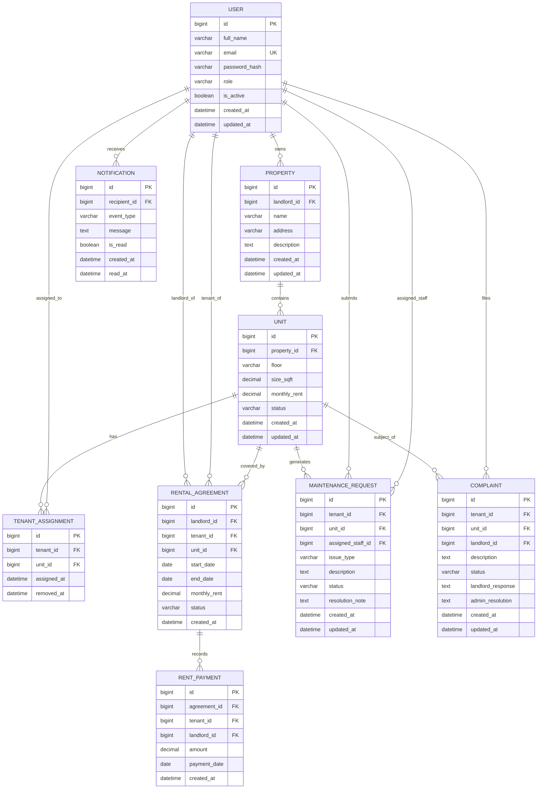

10-user-journey.md
# Smart Tenant-Landlord Management Platform - Entity Relationship Diagram (ERD)

> **Note:** This ERD is a **logical domain model** used for requirements and design communication.
> The physical persistence implementation uses **PostgreSQL** with full schema detail documented in [21-database-design.md](21-database-design.md).

## Entity Overview
| Entity | Purpose |
|---|---|
| User | Stores account credentials, role, and active status for all four user types |
| Property | Represents a landlord-owned building or premises |
| Unit | Represents an individual rentable space within a property |
| TenantAssignment | Records the active assignment of a tenant to a unit |
| RentalAgreement | Stores the formal terms of a tenancy between landlord and tenant |
| RentPayment | Logs individual rent payments made against an active agreement |
| MaintenanceRequest | Tracks tenant-submitted repair and upkeep requests through their lifecycle |
| Complaint | Records tenant complaints and their resolution thread |
| Notification | Stores in-app notification events delivered to users |

## Entity Attributes

### User
`id, full_name, email, password_hash, role, is_active, created_at, updated_at`

**role** values: `tenant`, `landlord`, `maintenance_staff`, `admin`

### Property
`id, landlord_id, name, address, description, created_at, updated_at`

### Unit
`id, property_id, floor, size_sqft, monthly_rent, status, created_at, updated_at`

**status** values: `vacant`, `occupied`

### TenantAssignment
`id, tenant_id, unit_id, assigned_at, removed_at`

### RentalAgreement
`id, landlord_id, tenant_id, unit_id, start_date, end_date, monthly_rent, status, created_at`

**status** values: `active`, `expired`, `terminated`

### RentPayment
`id, agreement_id, tenant_id, landlord_id, amount, payment_date, created_at`

### MaintenanceRequest
`id, tenant_id, unit_id, assigned_staff_id, issue_type, description, status, resolution_note, created_at, updated_at`

**status** values: `open`, `assigned`, `in_progress`, `resolved`

### Complaint
`id, tenant_id, unit_id, landlord_id, description, status, landlord_response, admin_resolution, created_at, updated_at`

**status** values: `open`, `responded`, `escalated`, `resolved`

### Notification
`id, recipient_id, event_type, message, is_read, created_at, read_at`

**event_type** values: `rent_due`, `maintenance_status_changed`, `complaint_response`, `staff_assigned`, `tenant_assigned`

## Relationship Rules
1. One **User** (landlord) owns many **Properties**.
2. One **Property** has many **Units**.
3. One **Unit** has at most one active **TenantAssignment** at a time.
4. One **TenantAssignment** links exactly one **User** (tenant) to one **Unit**.
5. One **RentalAgreement** links one landlord, one tenant, and one unit; a unit may have many agreements over time (history).
6. One **RentalAgreement** has many **RentPayments**.
7. One **Unit** may have many **MaintenanceRequests** over time; each request is submitted by one tenant and optionally assigned to one maintenance staff member.
8. One **Unit** may have many **Complaints** over time; each complaint belongs to one tenant and is addressed by the landlord and optionally escalated to admin.
9. One **User** receives many **Notifications**; each notification targets exactly one recipient.

## Mermaid ER Diagram

## Key Design Decisions
| Decision | Rationale |
|---|---|
| `TenantAssignment.removed_at` is nullable | Null means the assignment is still active; set on removal for history tracking |
| `RentalAgreement` is immutable once created | Only `status` transitions are permitted — agreement terms cannot be edited |
| `MaintenanceRequest.assigned_staff_id` is nullable | Requests start unassigned (Open) and are assigned by the landlord later |
| `Complaint` stores both `landlord_response` and `admin_resolution` | Preserves the full resolution thread in a single row for audit |
| `Notification.read_at` is nullable | Null means unread; set on mark-as-read action |
| All FKs use `bigint` | Supports growth beyond 32-bit integer limits without schema migration |