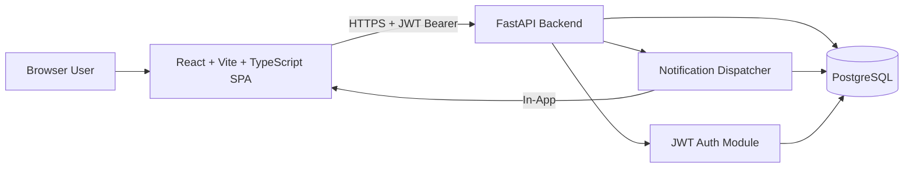
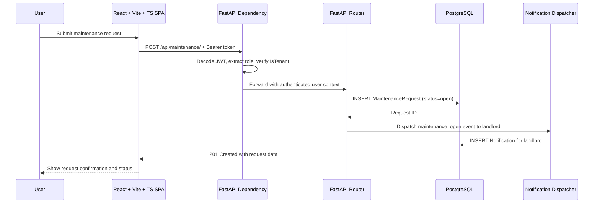
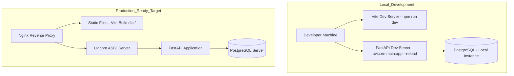

# Smart Tenant-Landlord Management Platform - System Design

## High-Level Design
The Smart Tenant-Landlord Management Platform follows a layered, API-first architecture:
1. **Presentation Layer:** React.js + Vite + TypeScript SPA with role-aware protected routes and responsive UI.
2. **Application Layer:** Python FastAPI backend organized into routers per domain module with JWT authentication and dependency-injected role guards.
3. **Data Layer:** PostgreSQL relational database accessed via SQLAlchemy ORM with Alembic migration-managed schema.
4. **Notification Layer:** Event-driven in-app notification dispatch triggered by domain events across all modules.

## Architecture Diagram

## Component Diagram

```mermaid
flowchart TD
  subgraph Frontend_React_Vite_TS
    FE1[Auth Pages - Login / Register]
    FE2[Landlord Pages - Properties / Units / Agreements / Rent]
    FE3[Tenant Pages - Agreement View / Payments / Requests / Complaints]
    FE4[Staff Pages - Assigned Request Queue]
    FE5[Admin Pages - User Management / Escalations]
    FE6[Shared - Dashboard / Notifications / Profile]
  end

  subgraph Backend_FastAPI
    subgraph Auth_Router
      A1[POST /auth/register]
      A2[POST /auth/login]
      A3[POST /auth/token/refresh]
      A4[POST /auth/logout]
      A5[get_current_user dependency]
      A6[require_role dependency factory]
    end

    subgraph Property_Router
      P1[PropertyRouter]
      P2[UnitRouter]
      P3[TenantAssignmentRouter]
    end

    subgraph Agreement_Router
      AG1[RentalAgreementRouter]
    end

    subgraph Rent_Router
      R1[RentPaymentRouter]
    end

    subgraph Maintenance_Router
      M1[MaintenanceRequestRouter]
    end

    subgraph Complaint_Router
      C1[ComplaintRouter]
    end

    subgraph Notification_Router
      N1[NotificationRouter]
      N2[NotificationDispatcher]
    end

    subgraph Dashboard_Router
      D1[LandlordDashboardRouter]
      D2[TenantDashboardRouter]
      D3[AdminDashboardRouter]
      D4[StaffDashboardRouter]
    end
  end

  DB[(PostgreSQL)]

  FE1 --> A1
  FE2 --> P1
  FE2 --> P2
  FE2 --> P3
  FE2 --> AG1
  FE2 --> R1
  FE3 --> AG1
  FE3 --> R1
  FE3 --> M1
  FE3 --> C1
  FE4 --> M1
  FE5 --> A5
  FE5 --> C1
  FE6 --> D1
  FE6 --> D2
  FE6 --> D3
  FE6 --> D4
  FE6 --> N1

  A1 --> DB
  A2 --> DB
  P1 --> DB
  P2 --> DB
  P3 --> DB
  AG1 --> DB
  R1 --> DB
  M1 --> DB
  C1 --> DB
  N1 --> DB
  N2 --> DB
  D1 --> DB
  D2 --> DB
  D3 --> DB
  D4 --> DB

  P3 --> N2
  AG1 --> N2
  R1 --> N2
  M1 --> N2
  C1 --> N2
```

## Request-Response Data Flow

## Module Ownership and Router Boundaries
| FastAPI Router | Owner | Models Managed |
|---|---|---|
| `auth_router` | M1 + M2 (shared) | User |
| `property_router` | M1 | Property, Unit, TenantAssignment |
| `agreement_router` | M1 (create), M2 (view) | RentalAgreement |
| `rent_router` | M1 | RentPayment |
| `maintenance_router` | M2 | MaintenanceRequest |
| `complaint_router` | M2 | Complaint |
| `notification_router` | M2 | Notification |
| `dashboard_router` | M1 (Landlord/Admin), M2 (Tenant/Staff) | Aggregation queries only — no new models |

> Cross-router data access is via shared SQLAlchemy models in a `models/` package imported by all routers. No direct router-to-router function calls are permitted.

## Security Architecture
| Layer | Control |
|---|---|
| Identity | JWT access tokens (15 min expiry) + refresh tokens (7 day expiry) via `python-jose` |
| API | FastAPI `Depends(require_role(...))` on every protected route — role checked server-side only |
| Data | TLS 1.2+ in transit; bcrypt password hashing via `passlib`; tenant data isolation at SQLAlchemy query layer |
| Admin | Admin-only routes gated by `require_role("admin")` dependency |
| Audit | Authentication failures and 403 events logged with request metadata via Python `logging` |
| Config | All secrets and credentials in environment variables via `python-dotenv` — never hardcoded |

## API Design Principles
1. All endpoints are RESTful with JSON request and response payloads.
2. URL structure: `/api/<resource>/` and `/api/<resource>/{id}/`
3. HTTP methods: `GET` (read), `POST` (create), `PUT`/`PATCH` (update), `DELETE` (delete).
4. All protected endpoints require `Authorization: Bearer <access_token>` header.
5. Request/response shapes defined as Pydantic schemas in a shared `schemas/` package.
6. Standard HTTP status codes: `200`, `201`, `204`, `400`, `401`, `403`, `404`, `409`.
7. Full endpoint catalog in [22-api-design.md](22-api-design.md).

## Deployment Architecture

## Key Technical Decisions
| Decision | Rationale |
|---|---|
| FastAPI over Django REST Framework | FastAPI's async support, automatic OpenAPI docs, and Pydantic-native validation reduce boilerplate; better fit for a modern API-first project |
| Pydantic schemas for validation | Type-safe request/response contracts generated automatically into OpenAPI spec; eliminates a separate serializer layer |
| SQLAlchemy + Alembic | Industry-standard ORM with expressive query API and Alembic for version-controlled migrations |
| PostgreSQL over NoSQL | Domain entities (agreements, payments, assignments) require strong relational integrity and foreign key constraints |
| JWT stateless auth via python-jose | Eliminates server-side session storage; supports horizontal scaling and clean M1/M2 module split |
| React + Vite + TypeScript | Vite's fast HMR improves dev experience; TypeScript enforces API contract types end-to-end from Pydantic schemas |
| Notification as a separate module | Decouples event dispatch from domain logic; any router can trigger notifications without circular dependencies |
