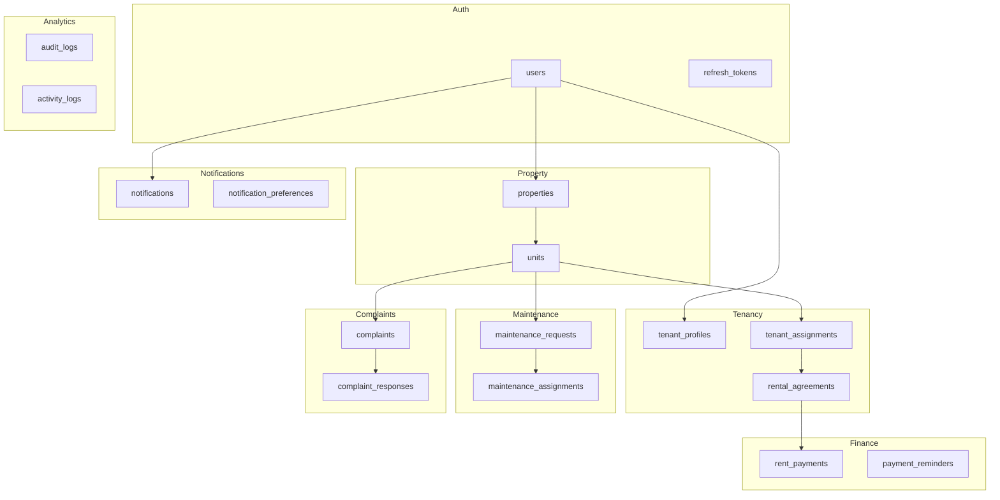

21-database-design.md
# Database Design

The Smart Tenant-Landlord Management Platform uses PostgreSQL as its primary relational database. The schema is designed around four user roles — Admin, Landlord, Tenant, and Maintenance Staff — and ten functional modules ranging from property management to analytics. All tables follow third normal form (3NF) to eliminate redundancy and ensure data integrity. Foreign key relationships enforce referential integrity at the database level, while application-layer validation in FastAPI handles business rule constraints. This document specifies the complete physical schema including table definitions, column types, constraints, indexes, and the migration strategy.

---

## Database Overview

| Attribute | Value |
|---|---|
| DBMS | PostgreSQL 15 |
| ORM | SQLAlchemy (via FastAPI) |
| Migration Tool | Alembic |
| Character Set | UTF-8 |
| Collation | en_US.UTF-8 |
| Connection Pooling | PgBouncer |
| Normal Form | 3NF throughout |
| Total Tables | 18 |

---

## Schema Diagram (Logical Groups)

---

## Table Definitions

### `users`

Central authentication table shared by all four roles. Role is stored as an enum to enforce valid values at the database level.

| Column | Type | Constraints | Description |
|---|---|---|---|
| id | UUID | PK, default gen_random_uuid() | Unique user identifier |
| email | VARCHAR(255) | UNIQUE, NOT NULL | Login email address |
| password_hash | VARCHAR(255) | NOT NULL | Bcrypt hashed password |
| role | ENUM('admin','landlord','tenant','maintenance_staff') | NOT NULL | User role |
| first_name | VARCHAR(100) | NOT NULL | Given name |
| last_name | VARCHAR(100) | NOT NULL | Family name |
| phone | VARCHAR(20) | NULLABLE | Contact number |
| is_active | BOOLEAN | NOT NULL, DEFAULT TRUE | Account status |
| created_at | TIMESTAMPTZ | NOT NULL, DEFAULT NOW() | Registration timestamp |
| updated_at | TIMESTAMPTZ | NOT NULL, DEFAULT NOW() | Last update timestamp |

**Indexes:** `idx_users_email` (unique), `idx_users_role`

---

### `refresh_tokens`

Tracks issued JWT refresh tokens to support token rotation and revocation.

| Column | Type | Constraints | Description |
|---|---|---|---|
| id | UUID | PK | Token record ID |
| user_id | UUID | FK → users.id ON DELETE CASCADE | Owning user |
| token_hash | VARCHAR(255) | UNIQUE, NOT NULL | SHA-256 hash of the refresh token |
| expires_at | TIMESTAMPTZ | NOT NULL | Token expiry time |
| revoked | BOOLEAN | NOT NULL, DEFAULT FALSE | Whether token has been revoked |
| created_at | TIMESTAMPTZ | NOT NULL, DEFAULT NOW() | Issuance time |

**Indexes:** `idx_refresh_tokens_user_id`, `idx_refresh_tokens_token_hash` (unique)

---

### `properties`

Represents physical buildings or complexes owned by landlords.

| Column | Type | Constraints | Description |
|---|---|---|---|
| id | UUID | PK | Property identifier |
| landlord_id | UUID | FK → users.id ON DELETE CASCADE | Owning landlord |
| name | VARCHAR(200) | NOT NULL | Property display name |
| address | TEXT | NOT NULL | Full street address |
| city | VARCHAR(100) | NOT NULL | City |
| district | VARCHAR(100) | NOT NULL | District or region |
| total_units | INTEGER | NOT NULL, DEFAULT 0 | Declared unit count |
| description | TEXT | NULLABLE | Optional notes |
| created_at | TIMESTAMPTZ | NOT NULL, DEFAULT NOW() | Creation timestamp |
| updated_at | TIMESTAMPTZ | NOT NULL, DEFAULT NOW() | Last update timestamp |

**Indexes:** `idx_properties_landlord_id`

---

### `units`

Represents individual rentable units within a property.

| Column | Type | Constraints | Description |
|---|---|---|---|
| id | UUID | PK | Unit identifier |
| property_id | UUID | FK → properties.id ON DELETE CASCADE | Parent property |
| unit_number | VARCHAR(20) | NOT NULL | Human-readable unit label (e.g. "3B") |
| floor | INTEGER | NULLABLE | Floor number |
| bedrooms | INTEGER | NOT NULL, DEFAULT 1 | Bedroom count |
| bathrooms | INTEGER | NOT NULL, DEFAULT 1 | Bathroom count |
| area_sqft | NUMERIC(8,2) | NULLABLE | Floor area in square feet |
| rent_amount | NUMERIC(10,2) | NOT NULL | Monthly rent |
| status | ENUM('vacant','occupied','maintenance') | NOT NULL, DEFAULT 'vacant' | Current occupancy status |
| created_at | TIMESTAMPTZ | NOT NULL, DEFAULT NOW() | Creation timestamp |
| updated_at | TIMESTAMPTZ | NOT NULL, DEFAULT NOW() | Last update timestamp |

**Constraints:** `UNIQUE (property_id, unit_number)`

**Indexes:** `idx_units_property_id`, `idx_units_status`

---

### `tenant_profiles`

Extended profile data for users with the tenant role.

| Column | Type | Constraints | Description |
|---|---|---|---|
| id | UUID | PK | Profile identifier |
| user_id | UUID | FK → users.id ON DELETE CASCADE, UNIQUE | Linked user account |
| nid | VARCHAR(50) | NULLABLE | National ID number |
| emergency_contact_name | VARCHAR(150) | NULLABLE | Emergency contact name |
| emergency_contact_phone | VARCHAR(20) | NULLABLE | Emergency contact number |
| occupation | VARCHAR(100) | NULLABLE | Tenant occupation |
| profile_photo_url | TEXT | NULLABLE | Storage URL for photo |
| created_at | TIMESTAMPTZ | NOT NULL, DEFAULT NOW() | Creation timestamp |
| updated_at | TIMESTAMPTZ | NOT NULL, DEFAULT NOW() | Last update timestamp |

**Indexes:** `idx_tenant_profiles_user_id` (unique)

---

### `tenant_assignments`

Links a tenant to a specific unit for a defined period.

| Column | Type | Constraints | Description |
|---|---|---|---|
| id | UUID | PK | Assignment identifier |
| unit_id | UUID | FK → units.id ON DELETE CASCADE | Assigned unit |
| tenant_id | UUID | FK → users.id ON DELETE CASCADE | Assigned tenant |
| assigned_by | UUID | FK → users.id | Landlord who created the assignment |
| start_date | DATE | NOT NULL | Assignment start date |
| end_date | DATE | NULLABLE | Assignment end date (null = ongoing) |
| status | ENUM('active','past','terminated') | NOT NULL, DEFAULT 'active' | Assignment status |
| created_at | TIMESTAMPTZ | NOT NULL, DEFAULT NOW() | Creation timestamp |
| updated_at | TIMESTAMPTZ | NOT NULL, DEFAULT NOW() | Last update timestamp |

**Constraints:** Partial unique index on `(unit_id)` WHERE `status = 'active'` — enforces one active tenant per unit.

**Indexes:** `idx_tenant_assignments_unit_id`, `idx_tenant_assignments_tenant_id`, `idx_tenant_assignments_status`

---

### `rental_agreements`

Formal rental contract linked to an active tenant assignment.

| Column | Type | Constraints | Description |
|---|---|---|---|
| id | UUID | PK | Agreement identifier |
| assignment_id | UUID | FK → tenant_assignments.id ON DELETE CASCADE | Parent assignment |
| landlord_id | UUID | FK → users.id | Signing landlord |
| tenant_id | UUID | FK → users.id | Signing tenant |
| start_date | DATE | NOT NULL | Lease start |
| end_date | DATE | NOT NULL | Lease end |
| monthly_rent | NUMERIC(10,2) | NOT NULL | Agreed monthly rent |
| security_deposit | NUMERIC(10,2) | NOT NULL, DEFAULT 0 | Security deposit amount |
| terms | TEXT | NULLABLE | Full agreement text |
| status | ENUM('draft','active','expired','terminated') | NOT NULL, DEFAULT 'draft' | Agreement status |
| signed_at | TIMESTAMPTZ | NULLABLE | Timestamp when both parties signed |
| created_at | TIMESTAMPTZ | NOT NULL, DEFAULT NOW() | Creation timestamp |
| updated_at | TIMESTAMPTZ | NOT NULL, DEFAULT NOW() | Last update timestamp |

**Indexes:** `idx_rental_agreements_assignment_id`, `idx_rental_agreements_tenant_id`, `idx_rental_agreements_status`

---

### `rent_payments`

Records each rent payment event against a rental agreement.

| Column | Type | Constraints | Description |
|---|---|---|---|
| id | UUID | PK | Payment identifier |
| agreement_id | UUID | FK → rental_agreements.id ON DELETE CASCADE | Parent agreement |
| tenant_id | UUID | FK → users.id | Paying tenant |
| amount | NUMERIC(10,2) | NOT NULL | Amount paid |
| due_date | DATE | NOT NULL | Date payment was due |
| paid_date | DATE | NULLABLE | Date payment was received |
| payment_method | ENUM('cash','bank_transfer','mobile_banking','other') | NOT NULL | Payment channel |
| status | ENUM('pending','paid','overdue','partial') | NOT NULL, DEFAULT 'pending' | Payment status |
| transaction_reference | VARCHAR(100) | NULLABLE | External reference or receipt number |
| notes | TEXT | NULLABLE | Optional notes |
| created_at | TIMESTAMPTZ | NOT NULL, DEFAULT NOW() | Creation timestamp |
| updated_at | TIMESTAMPTZ | NOT NULL, DEFAULT NOW() | Last update timestamp |

**Indexes:** `idx_rent_payments_agreement_id`, `idx_rent_payments_tenant_id`, `idx_rent_payments_status`, `idx_rent_payments_due_date`

---

### `payment_reminders`

Automated reminders scheduled around rent due dates.

| Column | Type | Constraints | Description |
|---|---|---|---|
| id | UUID | PK | Reminder identifier |
| payment_id | UUID | FK → rent_payments.id ON DELETE CASCADE | Target payment |
| tenant_id | UUID | FK → users.id | Recipient tenant |
| remind_at | TIMESTAMPTZ | NOT NULL | Scheduled delivery time |
| sent | BOOLEAN | NOT NULL, DEFAULT FALSE | Whether reminder was dispatched |
| sent_at | TIMESTAMPTZ | NULLABLE | Actual dispatch time |
| created_at | TIMESTAMPTZ | NOT NULL, DEFAULT NOW() | Creation timestamp |

**Indexes:** `idx_payment_reminders_payment_id`, `idx_payment_reminders_remind_at`

---

### `maintenance_requests`

Tenant-submitted requests for property repairs or services.

| Column | Type | Constraints | Description |
|---|---|---|---|
| id | UUID | PK | Request identifier |
| unit_id | UUID | FK → units.id ON DELETE CASCADE | Affected unit |
| tenant_id | UUID | FK → users.id | Submitting tenant |
| category | ENUM('plumbing','electrical','hvac','appliance','structural','other') | NOT NULL | Issue category |
| title | VARCHAR(200) | NOT NULL | Short issue summary |
| description | TEXT | NOT NULL | Detailed issue description |
| priority | ENUM('low','medium','high','urgent') | NOT NULL, DEFAULT 'medium' | Priority level |
| status | ENUM('open','in_progress','resolved','closed','rejected') | NOT NULL, DEFAULT 'open' | Current status |
| attachment_url | TEXT | NULLABLE | Photo or document upload URL |
| resolved_at | TIMESTAMPTZ | NULLABLE | Resolution timestamp |
| created_at | TIMESTAMPTZ | NOT NULL, DEFAULT NOW() | Submission timestamp |
| updated_at | TIMESTAMPTZ | NOT NULL, DEFAULT NOW() | Last update timestamp |

**Indexes:** `idx_maintenance_requests_unit_id`, `idx_maintenance_requests_tenant_id`, `idx_maintenance_requests_status`, `idx_maintenance_requests_priority`

---

### `maintenance_assignments`

Assigns a maintenance staff member to a specific request.

| Column | Type | Constraints | Description |
|---|---|---|---|
| id | UUID | PK | Assignment identifier |
| request_id | UUID | FK → maintenance_requests.id ON DELETE CASCADE | Target request |
| staff_id | UUID | FK → users.id | Assigned staff member |
| assigned_by | UUID | FK → users.id | Landlord who assigned |
| notes | TEXT | NULLABLE | Assignment instructions |
| status | ENUM('assigned','in_progress','completed') | NOT NULL, DEFAULT 'assigned' | Work status |
| completed_at | TIMESTAMPTZ | NULLABLE | Completion timestamp |
| created_at | TIMESTAMPTZ | NOT NULL, DEFAULT NOW() | Assignment creation time |
| updated_at | TIMESTAMPTZ | NOT NULL, DEFAULT NOW() | Last update timestamp |

**Indexes:** `idx_maintenance_assignments_request_id`, `idx_maintenance_assignments_staff_id`

---

### `complaints`

Formal complaints submitted by tenants about any aspect of their tenancy.

| Column | Type | Constraints | Description |
|---|---|---|---|
| id | UUID | PK | Complaint identifier |
| unit_id | UUID | FK → units.id ON DELETE CASCADE | Related unit |
| tenant_id | UUID | FK → users.id | Submitting tenant |
| category | ENUM('noise','safety','billing','neighbor','management','other') | NOT NULL | Complaint category |
| subject | VARCHAR(200) | NOT NULL | Complaint headline |
| description | TEXT | NOT NULL | Full complaint description |
| status | ENUM('open','under_review','resolved','dismissed') | NOT NULL, DEFAULT 'open' | Resolution status |
| created_at | TIMESTAMPTZ | NOT NULL, DEFAULT NOW() | Submission timestamp |
| updated_at | TIMESTAMPTZ | NOT NULL, DEFAULT NOW() | Last update timestamp |

**Indexes:** `idx_complaints_unit_id`, `idx_complaints_tenant_id`, `idx_complaints_status`

---

### `complaint_responses`

Landlord or admin responses to tenant complaints.

| Column | Type | Constraints | Description |
|---|---|---|---|
| id | UUID | PK | Response identifier |
| complaint_id | UUID | FK → complaints.id ON DELETE CASCADE | Parent complaint |
| responder_id | UUID | FK → users.id | Responding user |
| message | TEXT | NOT NULL | Response text |
| created_at | TIMESTAMPTZ | NOT NULL, DEFAULT NOW() | Response timestamp |

**Indexes:** `idx_complaint_responses_complaint_id`

---

### `notifications`

In-app notification records for all platform events.

| Column | Type | Constraints | Description |
|---|---|---|---|
| id | UUID | PK | Notification identifier |
| user_id | UUID | FK → users.id ON DELETE CASCADE | Recipient user |
| type | VARCHAR(50) | NOT NULL | Event type code (e.g. RENT_DUE, REQUEST_UPDATED) |
| title | VARCHAR(200) | NOT NULL | Notification headline |
| message | TEXT | NOT NULL | Full notification body |
| is_read | BOOLEAN | NOT NULL, DEFAULT FALSE | Read status |
| related_entity_type | VARCHAR(50) | NULLABLE | Entity type for deep linking (e.g. 'payment') |
| related_entity_id | UUID | NULLABLE | ID of the related entity |
| created_at | TIMESTAMPTZ | NOT NULL, DEFAULT NOW() | Creation timestamp |

**Indexes:** `idx_notifications_user_id`, `idx_notifications_is_read`, `idx_notifications_created_at`

---

### `notification_preferences`

User-level preferences controlling which notification types are delivered.

| Column | Type | Constraints | Description |
|---|---|---|---|
| id | UUID | PK | Preference record identifier |
| user_id | UUID | FK → users.id ON DELETE CASCADE, UNIQUE | Owning user |
| email_notifications | BOOLEAN | NOT NULL, DEFAULT TRUE | Enable email delivery |
| in_app_notifications | BOOLEAN | NOT NULL, DEFAULT TRUE | Enable in-app delivery |
| rent_reminders | BOOLEAN | NOT NULL, DEFAULT TRUE | Rent due reminders |
| maintenance_updates | BOOLEAN | NOT NULL, DEFAULT TRUE | Maintenance status updates |
| complaint_updates | BOOLEAN | NOT NULL, DEFAULT TRUE | Complaint status updates |
| created_at | TIMESTAMPTZ | NOT NULL, DEFAULT NOW() | Creation timestamp |
| updated_at | TIMESTAMPTZ | NOT NULL, DEFAULT NOW() | Last update timestamp |

**Indexes:** `idx_notification_preferences_user_id` (unique)

---

### `audit_logs`

Immutable audit trail for security-sensitive actions across the platform.

| Column | Type | Constraints | Description |
|---|---|---|---|
| id | UUID | PK | Log entry identifier |
| actor_id | UUID | NULLABLE, FK → users.id ON DELETE SET NULL | User who performed the action |
| action | VARCHAR(100) | NOT NULL | Action code (e.g. USER_LOGIN, AGREEMENT_CREATED) |
| entity_type | VARCHAR(50) | NULLABLE | Affected entity type |
| entity_id | UUID | NULLABLE | Affected entity ID |
| ip_address | VARCHAR(45) | NULLABLE | Client IP at time of action |
| metadata | JSONB | NULLABLE | Additional structured context |
| created_at | TIMESTAMPTZ | NOT NULL, DEFAULT NOW() | Event timestamp |

**Indexes:** `idx_audit_logs_actor_id`, `idx_audit_logs_action`, `idx_audit_logs_created_at`

> Audit log rows are never updated or deleted. Application-layer and DB-level permissions enforce this constraint.

---

### `activity_logs`

Aggregated activity metrics used by the analytics dashboard.

| Column | Type | Constraints | Description |
|---|---|---|---|
| id | UUID | PK | Log entry identifier |
| user_id | UUID | FK → users.id ON DELETE CASCADE | Acting user |
| module | VARCHAR(50) | NOT NULL | Feature module name |
| action_type | VARCHAR(50) | NOT NULL | Action category |
| count | INTEGER | NOT NULL, DEFAULT 1 | Event count for the time bucket |
| logged_date | DATE | NOT NULL | Aggregation date |
| created_at | TIMESTAMPTZ | NOT NULL, DEFAULT NOW() | Record creation time |

**Constraints:** `UNIQUE (user_id, module, action_type, logged_date)` — upserted by background jobs.

**Indexes:** `idx_activity_logs_user_id`, `idx_activity_logs_logged_date`

---

## Normalization Summary

| Normal Form | Status | Notes |
|---|---|---|
| 1NF | ✅ | All columns atomic; no repeating groups |
| 2NF | ✅ | All non-key columns fully dependent on primary key |
| 3NF | ✅ | No transitive dependencies; lookup values use ENUMs or FK references |
| BCNF | ✅ Partial | Achieved where functional dependencies are deterministic; minor relaxations in JSONB metadata columns |

---

## Enum Type Definitions

All ENUM types are defined as PostgreSQL custom types to enforce valid values at the database engine level.

| Enum Name | Values |
|---|---|
| user_role | admin, landlord, tenant, maintenance_staff |
| unit_status | vacant, occupied, maintenance |
| assignment_status | active, past, terminated |
| agreement_status | draft, active, expired, terminated |
| payment_status | pending, paid, overdue, partial |
| payment_method | cash, bank_transfer, mobile_banking, other |
| maintenance_category | plumbing, electrical, hvac, appliance, structural, other |
| request_priority | low, medium, high, urgent |
| request_status | open, in_progress, resolved, closed, rejected |
| complaint_category | noise, safety, billing, neighbor, management, other |
| complaint_status | open, under_review, resolved, dismissed |
| staff_work_status | assigned, in_progress, completed |

---

## Index Strategy

| Index | Table | Columns | Type | Rationale |
|---|---|---|---|---|
| idx_users_email | users | email | Unique B-Tree | Login lookup |
| idx_units_status | units | status | B-Tree | Dashboard vacancy filter |
| idx_rent_payments_due_date | rent_payments | due_date | B-Tree | Overdue payment scanning |
| idx_rent_payments_status | rent_payments | status | B-Tree | Rent tracking filters |
| idx_maintenance_requests_status | maintenance_requests | status | B-Tree | Open request lists |
| idx_maintenance_requests_priority | maintenance_requests | priority | B-Tree | Priority queue sorting |
| idx_notifications_is_read | notifications | is_read | Partial B-Tree | Unread badge counts |
| idx_audit_logs_created_at | audit_logs | created_at | BRIN | Time-range log queries |
| idx_activity_logs_logged_date | activity_logs | logged_date | B-Tree | Analytics date range queries |

---

## Data Integrity Rules

| Rule ID | Description | Enforcement Layer |
|---|---|---|
| DI-01 | Each unit may have at most one active tenant assignment at a time | DB partial unique index |
| DI-02 | A rental agreement must reference a valid active tenant assignment | FK + application check |
| DI-03 | Rent payments must not exceed the agreed monthly rent without explicit override | Application layer |
| DI-04 | Audit log rows cannot be updated or deleted | DB role permissions |
| DI-05 | User role cannot be changed after account creation without admin action | Application layer |
| DI-06 | Refresh tokens are hashed before storage; raw tokens never persisted | Application layer |
| DI-07 | Unit status transitions (vacant → occupied → maintenance) must follow valid paths | Application layer |
| DI-08 | Notification preferences are created automatically on user registration | Application trigger |

---

## Migration Strategy

Database migrations are managed with **Alembic**, the standard migration framework for SQLAlchemy projects.

| Phase | Action | Tool |
|---|---|---|
| Initial setup | Generate base schema from SQLAlchemy models | `alembic revision --autogenerate` |
| Development | Apply migrations locally | `alembic upgrade head` |
| Staging | Run migration as part of CI pipeline | GitHub Actions + `alembic upgrade head` |
| Production | Manual review + apply during deployment window | `alembic upgrade head` with dry-run check |
| Rollback | Revert last applied migration | `alembic downgrade -1` |

Migration files are version-controlled in `alembic/versions/` and reviewed in pull requests before merge. Destructive operations (column drops, table renames) require an explicit downgrade path and a data backup confirmation before CI approves the merge.

---

## Seed Data

| Entity | Seed Records | Purpose |
|---|---|---|
| Admin user | 1 | Default system administrator account |
| Landlord users | 2 | Demo landlord accounts for development testing |
| Tenant users | 4 | Demo tenant accounts with full profiles |
| Maintenance staff | 2 | Demo staff accounts for assignment testing |
| Properties | 3 | Sample buildings covering different districts |
| Units | 10 | Mix of vacant and occupied units |
| Rental agreements | 4 | Active leases covering current and upcoming periods |
| Maintenance requests | 6 | Various categories and priorities |

Seed scripts are located in `scripts/seed.py` and are run manually in development using `python scripts/seed.py`. They are never executed in production.