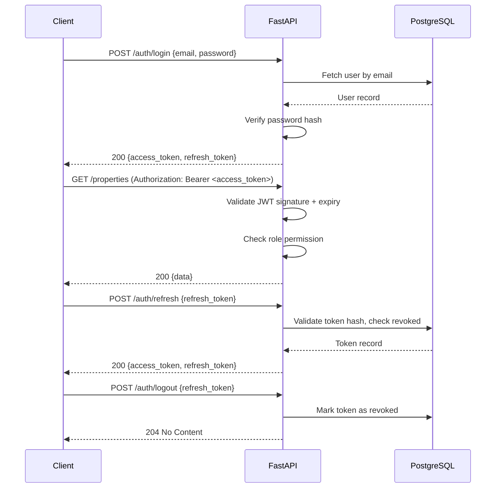

# API Design

The Smart Tenant-Landlord Management Platform exposes a RESTful HTTP API built with FastAPI. All endpoints follow consistent URL conventions, use JSON for request and response bodies, and are secured with JWT-based authentication. The API is versioned under the `/api/v1/` prefix to allow non-breaking evolution. Role-based access control (RBAC) is enforced at the route level — each endpoint declares which roles are permitted, and the authentication middleware rejects requests that do not match. This document covers the complete endpoint catalogue, request/response schemas, authentication flow, error conventions, and rate limiting policy.

---

## API Overview

| Attribute | Value |
|---|---|
| Base URL | `https://api.smarttenant.dev/api/v1` |
| Protocol | HTTPS only |
| Data Format | JSON (`application/json`) |
| Authentication | JWT Bearer tokens |
| Token Lifetime (Access) | 15 minutes |
| Token Lifetime (Refresh) | 7 days |
| API Versioning | URI prefix (`/api/v1/`) |
| Documentation | Auto-generated via FastAPI `/docs` (Swagger UI) |
| Rate Limiting | 100 requests / minute per authenticated user |

---

## Authentication Flow



---

## Role Permission Matrix

| Endpoint Group | Admin | Landlord | Tenant | Maintenance Staff |
|---|---|---|---|---|
| Auth | ✅ | ✅ | ✅ | ✅ |
| Users (admin management) | ✅ | ❌ | ❌ | ❌ |
| Properties | ✅ (read) | ✅ (full) | ❌ | ❌ |
| Units | ✅ (read) | ✅ (full) | ✅ (read own) | ❌ |
| Tenant Profiles | ✅ | ✅ (read) | ✅ (own) | ❌ |
| Tenant Assignments | ✅ | ✅ (full) | ✅ (read own) | ❌ |
| Rental Agreements | ✅ | ✅ (full) | ✅ (read own) | ❌ |
| Rent Payments | ✅ | ✅ (full) | ✅ (read/create own) | ❌ |
| Maintenance Requests | ✅ | ✅ (read/update) | ✅ (create/read own) | ✅ (read assigned) |
| Maintenance Assignments | ✅ | ✅ (full) | ❌ | ✅ (read own) |
| Complaints | ✅ | ✅ (read/respond) | ✅ (create/read own) | ❌ |
| Notifications | ✅ | ✅ (own) | ✅ (own) | ✅ (own) |
| Analytics | ✅ | ✅ (own properties) | ❌ | ❌ |

---

## Standard Response Envelope

All successful responses use a consistent wrapper:

```json
{
  "success": true,
  "data": { },
  "message": "Operation completed successfully",
  "meta": {
    "page": 1,
    "page_size": 20,
    "total": 150
  }
}
```

The `meta` field is omitted for non-paginated responses. Error responses follow the structure below:

```json
{
  "success": false,
  "error": {
    "code": "VALIDATION_ERROR",
    "message": "email: field required",
    "details": [ ]
  }
}
```

---

## Error Code Reference

| HTTP Status | Error Code | Meaning |
|---|---|---|
| 400 | VALIDATION_ERROR | Request body or query param failed validation |
| 401 | UNAUTHORIZED | Missing or invalid access token |
| 403 | FORBIDDEN | Valid token but insufficient role |
| 404 | NOT_FOUND | Requested resource does not exist |
| 409 | CONFLICT | State conflict (e.g. duplicate active assignment) |
| 422 | UNPROCESSABLE | Business rule violation (e.g. invalid status transition) |
| 429 | RATE_LIMITED | Too many requests |
| 500 | INTERNAL_ERROR | Unexpected server error |

---

## Endpoint Catalogue

### Authentication — `/auth`

| Method | Path | Role | Description |
|---|---|---|---|
| POST | `/auth/register` | Public | Register a new user account |
| POST | `/auth/login` | Public | Authenticate and receive tokens |
| POST | `/auth/refresh` | Public | Rotate access and refresh tokens |
| POST | `/auth/logout` | Authenticated | Revoke the current refresh token |
| GET | `/auth/me` | Authenticated | Return current user profile |
| PATCH | `/auth/me` | Authenticated | Update own name, phone |
| POST | `/auth/change-password` | Authenticated | Change own password |

**POST /auth/register — Request**
```json
{
  "email": "jane@example.com",
  "password": "SecurePass123!",
  "first_name": "Jane",
  "last_name": "Doe",
  "role": "tenant",
  "phone": "+8801700000000"
}
```

**POST /auth/login — Response**
```json
{
  "success": true,
  "data": {
    "access_token": "<jwt>",
    "refresh_token": "<jwt>",
    "token_type": "bearer",
    "user": {
      "id": "uuid",
      "email": "jane@example.com",
      "role": "tenant",
      "first_name": "Jane",
      "last_name": "Doe"
    }
  }
}
```

---

### Users (Admin) — `/users`

| Method | Path | Role | Description |
|---|---|---|---|
| GET | `/users` | Admin | List all users with filters |
| GET | `/users/{id}` | Admin | Get user by ID |
| PATCH | `/users/{id}` | Admin | Update user details |
| PATCH | `/users/{id}/deactivate` | Admin | Deactivate a user account |
| PATCH | `/users/{id}/activate` | Admin | Reactivate a user account |
| DELETE | `/users/{id}` | Admin | Soft-delete a user |

**GET /users — Query Parameters**

| Parameter | Type | Description |
|---|---|---|
| role | string | Filter by role |
| is_active | boolean | Filter by active status |
| search | string | Search by name or email |
| page | integer | Page number (default: 1) |
| page_size | integer | Results per page (default: 20, max: 100) |

---

### Properties — `/properties`

| Method | Path | Role | Description |
|---|---|---|---|
| POST | `/properties` | Landlord | Create a new property |
| GET | `/properties` | Landlord, Admin | List own (or all for admin) properties |
| GET | `/properties/{id}` | Landlord, Admin | Get property details |
| PATCH | `/properties/{id}` | Landlord | Update property details |
| DELETE | `/properties/{id}` | Landlord | Delete property (only if no active units) |

**POST /properties — Request**
```json
{
  "name": "Mirpur Heights",
  "address": "12 Block C, Mirpur-10",
  "city": "Dhaka",
  "district": "Dhaka",
  "total_units": 24,
  "description": "6-storey residential building."
}
```

---

### Units — `/properties/{property_id}/units`

| Method | Path | Role | Description |
|---|---|---|---|
| POST | `/properties/{property_id}/units` | Landlord | Add a unit to a property |
| GET | `/properties/{property_id}/units` | Landlord, Admin | List units for a property |
| GET | `/properties/{property_id}/units/{id}` | Landlord, Admin, Tenant (own) | Get unit details |
| PATCH | `/properties/{property_id}/units/{id}` | Landlord | Update unit details |
| DELETE | `/properties/{property_id}/units/{id}` | Landlord | Remove vacant unit |
| GET | `/units/vacant` | Landlord, Admin | List all vacant units across properties |

**PATCH /units/{id} — Request**
```json
{
  "rent_amount": 18000,
  "status": "maintenance"
}
```

---

### Tenant Profiles — `/tenants`

| Method | Path | Role | Description |
|---|---|---|---|
| GET | `/tenants` | Landlord, Admin | List all tenant profiles |
| GET | `/tenants/{id}` | Landlord, Admin, Tenant (own) | Get tenant profile |
| POST | `/tenants/profile` | Tenant | Create own extended profile |
| PATCH | `/tenants/profile` | Tenant | Update own extended profile |
| GET | `/tenants/{id}/assignments` | Landlord, Admin | View assignment history for a tenant |

---

### Tenant Assignments — `/assignments`

| Method | Path | Role | Description |
|---|---|---|---|
| POST | `/assignments` | Landlord | Assign a tenant to a unit |
| GET | `/assignments` | Landlord, Admin | List all assignments with filters |
| GET | `/assignments/{id}` | Landlord, Admin, Tenant (own) | Get assignment details |
| PATCH | `/assignments/{id}/terminate` | Landlord | Terminate an active assignment |

**POST /assignments — Request**
```json
{
  "unit_id": "uuid",
  "tenant_id": "uuid",
  "start_date": "2025-07-01",
  "end_date": "2026-06-30"
}
```

**GET /assignments — Query Parameters**

| Parameter | Type | Description |
|---|---|---|
| unit_id | UUID | Filter by unit |
| tenant_id | UUID | Filter by tenant |
| status | string | active, past, terminated |
| property_id | UUID | Filter by parent property |

---

### Rental Agreements — `/agreements`

| Method | Path | Role | Description |
|---|---|---|---|
| POST | `/agreements` | Landlord | Create a draft agreement |
| GET | `/agreements` | Landlord, Admin | List agreements with filters |
| GET | `/agreements/{id}` | Landlord, Admin, Tenant (own) | Get agreement details |
| PATCH | `/agreements/{id}` | Landlord | Update draft agreement |
| POST | `/agreements/{id}/activate` | Landlord | Activate a draft agreement |
| POST | `/agreements/{id}/terminate` | Landlord | Terminate an active agreement |

**POST /agreements — Request**
```json
{
  "assignment_id": "uuid",
  "start_date": "2025-07-01",
  "end_date": "2026-06-30",
  "monthly_rent": 18000,
  "security_deposit": 36000,
  "terms": "Standard residential lease terms apply."
}
```

---

### Rent Payments — `/payments`

| Method | Path | Role | Description |
|---|---|---|---|
| POST | `/payments` | Tenant, Landlord | Record a rent payment |
| GET | `/payments` | Landlord, Admin | List payments with filters |
| GET | `/payments/my` | Tenant | List own payment history |
| GET | `/payments/{id}` | Landlord, Admin, Tenant (own) | Get payment details |
| PATCH | `/payments/{id}/status` | Landlord | Update payment status |
| GET | `/payments/overdue` | Landlord, Admin | List all overdue payments |

**POST /payments — Request**
```json
{
  "agreement_id": "uuid",
  "amount": 18000,
  "due_date": "2025-08-01",
  "paid_date": "2025-07-30",
  "payment_method": "bank_transfer",
  "transaction_reference": "TXN-20250730-001"
}
```

**GET /payments — Query Parameters**

| Parameter | Type | Description |
|---|---|---|
| agreement_id | UUID | Filter by agreement |
| tenant_id | UUID | Filter by tenant |
| status | string | pending, paid, overdue, partial |
| from_date | date | Payment due date range start |
| to_date | date | Payment due date range end |

---

### Maintenance Requests — `/maintenance/requests`

| Method | Path | Role | Description |
|---|---|---|---|
| POST | `/maintenance/requests` | Tenant | Submit a new request |
| GET | `/maintenance/requests` | Landlord, Admin | List all requests with filters |
| GET | `/maintenance/requests/my` | Tenant | List own submitted requests |
| GET | `/maintenance/requests/assigned` | Maintenance Staff | List requests assigned to self |
| GET | `/maintenance/requests/{id}` | All roles (scoped) | Get request details |
| PATCH | `/maintenance/requests/{id}/status` | Landlord, Staff | Update request status |
| DELETE | `/maintenance/requests/{id}` | Landlord | Close or reject a request |

**POST /maintenance/requests — Request**
```json
{
  "unit_id": "uuid",
  "category": "plumbing",
  "title": "Leaking kitchen tap",
  "description": "The kitchen tap has been dripping for 3 days. Water visible under the sink.",
  "priority": "medium"
}
```

---

### Maintenance Assignments — `/maintenance/assignments`

| Method | Path | Role | Description |
|---|---|---|---|
| POST | `/maintenance/assignments` | Landlord | Assign a request to staff |
| GET | `/maintenance/assignments` | Landlord, Admin | List all staff assignments |
| GET | `/maintenance/assignments/my` | Maintenance Staff | List own assignments |
| PATCH | `/maintenance/assignments/{id}/status` | Maintenance Staff | Update work status |

**POST /maintenance/assignments — Request**
```json
{
  "request_id": "uuid",
  "staff_id": "uuid",
  "notes": "Bring replacement tap washers. Expected time: 1 hour."
}
```

---

### Complaints — `/complaints`

| Method | Path | Role | Description |
|---|---|---|---|
| POST | `/complaints` | Tenant | Submit a complaint |
| GET | `/complaints` | Landlord, Admin | List all complaints |
| GET | `/complaints/my` | Tenant | List own complaints |
| GET | `/complaints/{id}` | Landlord, Admin, Tenant (own) | Get complaint details with responses |
| PATCH | `/complaints/{id}/status` | Landlord, Admin | Update complaint status |
| POST | `/complaints/{id}/responses` | Landlord, Admin | Add a response to a complaint |

**POST /complaints — Request**
```json
{
  "unit_id": "uuid",
  "category": "noise",
  "subject": "Loud music from unit 4A after midnight",
  "description": "This has happened on 3 consecutive nights this week."
}
```

---

### Notifications — `/notifications`

| Method | Path | Role | Description |
|---|---|---|---|
| GET | `/notifications` | Authenticated | List own notifications (paginated) |
| GET | `/notifications/unread-count` | Authenticated | Return count of unread notifications |
| PATCH | `/notifications/{id}/read` | Authenticated | Mark a single notification as read |
| POST | `/notifications/read-all` | Authenticated | Mark all notifications as read |
| DELETE | `/notifications/{id}` | Authenticated | Delete a single notification |
| GET | `/notifications/preferences` | Authenticated | Get own notification preferences |
| PATCH | `/notifications/preferences` | Authenticated | Update own notification preferences |

**GET /notifications — Response (sample)**
```json
{
  "success": true,
  "data": [
    {
      "id": "uuid",
      "type": "RENT_DUE",
      "title": "Rent Due in 3 Days",
      "message": "Your rent of BDT 18,000 for Unit 3B is due on August 1, 2025.",
      "is_read": false,
      "related_entity_type": "payment",
      "related_entity_id": "uuid",
      "created_at": "2025-07-29T08:00:00Z"
    }
  ],
  "meta": { "page": 1, "page_size": 20, "total": 5 }
}
```

---

### Analytics — `/analytics`

| Method | Path | Role | Description |
|---|---|---|---|
| GET | `/analytics/overview` | Landlord, Admin | Summary KPIs (units, occupancy, revenue) |
| GET | `/analytics/occupancy` | Landlord, Admin | Occupancy rate over time |
| GET | `/analytics/revenue` | Landlord, Admin | Monthly rent collection trends |
| GET | `/analytics/maintenance` | Landlord, Admin | Request volume by category and status |
| GET | `/analytics/complaints` | Landlord, Admin | Complaint trends by category |
| GET | `/analytics/admin/platform` | Admin | Platform-wide aggregated metrics |

**GET /analytics/overview — Response (sample)**
```json
{
  "success": true,
  "data": {
    "total_properties": 3,
    "total_units": 24,
    "occupied_units": 18,
    "vacant_units": 6,
    "occupancy_rate": 75.0,
    "monthly_revenue_expected": 324000,
    "monthly_revenue_collected": 288000,
    "collection_rate": 88.9,
    "open_maintenance_requests": 4,
    "open_complaints": 2
  }
}
```

**GET /analytics/revenue — Query Parameters**

| Parameter | Type | Description |
|---|---|---|
| from_date | date | Start of date range |
| to_date | date | End of date range |
| property_id | UUID | Filter to a single property |
| group_by | string | month or week |

---

## Pagination Convention

All list endpoints support cursor-free page-based pagination via query parameters.

| Parameter | Default | Max | Description |
|---|---|---|---|
| page | 1 | — | Page number |
| page_size | 20 | 100 | Results per page |
| sort_by | created_at | — | Sort field |
| order | desc | — | asc or desc |

---

## Rate Limiting

| Limit | Scope | Response |
|---|---|---|
| 100 req/min | Per authenticated user | 429 with `Retry-After` header |
| 20 req/min | Per IP on `/auth/login` | 429 to prevent brute-force |
| 10 req/min | Per IP on `/auth/register` | 429 to prevent mass registration |

Rate limit headers are included in all responses:

```
X-RateLimit-Limit: 100
X-RateLimit-Remaining: 87
X-RateLimit-Reset: 1722326460
```

---

## API Versioning Policy

The current stable version is `v1`. Breaking changes — including field removal, type changes, and endpoint removal — will be released under `/api/v2/` with a minimum 90-day deprecation notice on `v1`. Non-breaking additions (new optional fields, new endpoints) may be added to `v1` without a version bump.